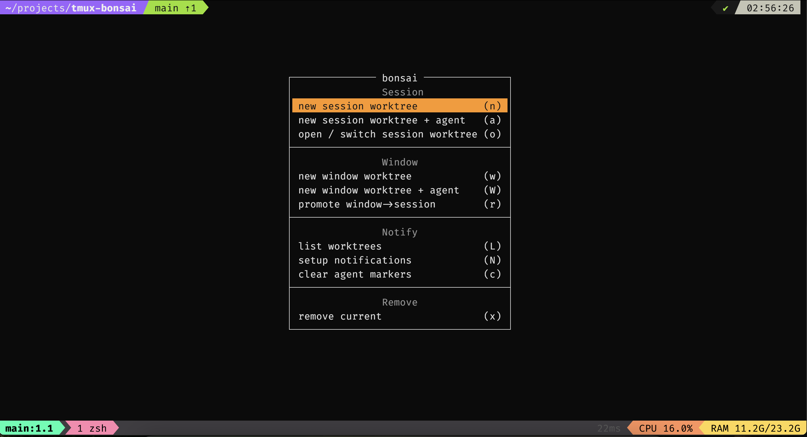

# 🌳 tmux-bonsai

> Cultivate parallel git worktrees and AI agents across branches — without leaving tmux.

**tmux-bonsai** turns your tmux server into a workbench for a git **worktree-per-task**
workflow. Spin up an isolated worktree for any branch, drop it into its own tmux session,
and launch an AI coding agent (Claude Code, opencode, …) right where the work lives — then
get pinged the moment any agent in any session finishes or needs input. Jump between tasks
with a single `fzf` picker, and promote a scratch window into its own session. Like tending
a bonsai: many small branches, each shaped deliberately, all in view at once.

Bring your own layout: bonsai never enforces one — shape each session with a separate
plugin (tmuxinator, smug) or a tmux `session-created` hook (see [Layout](#layout)).

<p align="center">
  
</p>

[worktrunk](https://worktrunk.dev) (`wt`) is the git engine; the plugin owns all the
tmux orchestration. **No worktrunk config / hooks required** — every `wt` call is made
with `--no-hooks --no-cd`, and the plugin creates the session, switches the client, and
tears things down itself.

## Requirements

- tmux **>= 3.2** (`display-popup`)
- [worktrunk](https://worktrunk.dev) (`wt`) on `PATH`
- `git`, `awk`, `sed` (standard)
- `fzf` — for the "open / switch" picker
- your agent CLI (`claude`, `opencode`, ...) — for "new + agent"

That's it. No `~/.config/worktrunk/config.toml`, no shell functions.

## Install

### TPM
```tmux
set -g @plugin 'PedroLaRosa/tmux-bonsai'
run '~/.tmux/plugins/tpm/tpm'   # keep this last — @plugin lines go above it
```
`prefix + I` to fetch. No clone needed; TPM installs into `~/.tmux/plugins/tmux-bonsai/`.

Pin a release instead of tracking the default branch:
```tmux
set -g @plugin 'PedroLaRosa/tmux-bonsai#v1.0.0'
```

### Local / no TPM
```tmux
run-shell '~/code/tmux-bonsai/bonsai.tmux'
```
`tmux source-file ~/.tmux.conf` to reload.

## Use

`prefix + W` opens the menu:

| Key | Action |
|-----|--------|
| n | New worktree → its own session |
| a | New worktree + launch the agent in that session |
| o | Open / switch — fzf over worktrees **and** local/remote branches (with log preview) |
| w | New worktree as a **window** in the current session |
| r | Promote the current window-worktree into its own session |
| \| | Split the current pane **right** and launch the agent (same worktree) |
| _ | Split the current pane **down** and launch the agent (same worktree) |
| d | **Dashboard** — live jump board of every worktree + agent, one key jumps to the exact pane |
| L | List all worktrees (`wt list --full`) |
| N | Set up agent notifications (writes the Claude Code + opencode hooks) |
| c | Clear all agent markers (per pane) |
| x | Remove the current worktree (auto-detects session vs window) |

The "open / switch" picker handles all three navigation cases in one place: an existing
worktree (jumps to its session), a local branch with no worktree yet, or a teammate's
remote branch (worktrunk checks it out into a fresh worktree, then the plugin builds the
session).

**Backing out returns to the menu.** Cancelling a popup action — ESC in the
`o` picker, an empty prompt (just Enter) in `n`/`a`/`w`, or any key to close the
informational `L`/`N` views — re-opens the bonsai menu instead of dropping you
back in your pane. Completing an action (creating or switching a worktree) does
not re-open it. The menu thus behaves like a navigable hierarchy rather than a
one-shot launcher.

## Options

```tmux
set -g @bonsai-key           'W'        # menu key (under prefix)
set -g @bonsai-agent         'claude'   # 'opencode', 'opencode run', ...
set -g @bonsai-notify        'on'       # agent markers + focus-clear
set -g @bonsai-dashboard-key ''         # optional direct key for the dashboard (under prefix); unset = via menu only
set -g @bonsai-refresh       '2'        # dashboard live-refresh interval, in seconds
```

## Layout

bonsai creates a **bare single-window session** at the worktree path and switches to it —
nothing more. Shape it however you like; bonsai never overrides your choice:

```tmux
# example: split every new session into editor + side terminal
set-hook -g session-created 'split-window -h ; select-pane -L'
```

For richer, per-project layouts use a dedicated tool like
[tmuxinator](https://github.com/tmuxinator/tmuxinator) or
[smug](https://github.com/ivaaaan/smug).

## How it stays config-free

| Step | Who does it |
|------|-------------|
| create branch + worktree, copy `.env`, remove | `wt` (`--no-hooks --no-cd`) |
| find the worktree path | `git worktree list --porcelain` |
| create session, switch client, kill session/window | the plugin |

So worktrunk never needs to know about tmux, and tmux never needs a worktrunk config file.


## Agent notifications

Get alerted when an agent in **any** pane/window/session finishes or needs input.
Two layers:

### Layer 1 — agent-native hooks (precise)

Run **`prefix + W` -> "setup notifications"** (or `scripts/install-notify.sh` directly).
It wires both agents to `scripts/notify.sh`:

- **Claude Code** -> merges into `~/.claude/settings.json`:
  `UserPromptSubmit` -> `notify.sh working`, `Stop` -> `notify.sh done`,
  `Notification` -> `notify.sh waiting`.
- **opencode** -> drops an auto-loaded plugin at `~/.config/opencode/plugin/wt-notify.js`
  that maps the `chat.message` hook -> working, `session.idle` -> done and `session.error` -> error.
  (If your opencode version loads from `plugins/` instead of `plugin/`, move the file.)

`notify.sh` runs inside the agent's pane (`$TMUX_PANE`), so it:

1. Marks that **pane** with `@agent_state` (`working` / `waiting` / `done` / `error`) plus a
   `@agent_state_ts` timestamp — the pane is the source of truth, so each split-pane agent is
   tracked independently. It also mirrors the state onto the window (a coarse single-agent rollup
   for the optional status-line glyph below).
2. Fires a desktop notification **only if you aren't already looking at that exact pane**
   (`notify-send` on Linux, `terminal-notifier`/`osascript` on macOS). `working` is mark-only
   (it fires every turn), so it never alerts.

| state | glyph | meaning |
|-------|-------|---------|
| working | 🔄 | agent is actively running (mark-only, no alert) |
| waiting | 💬 | agent needs your input |
| done | ✅ | agent finished |
| error | ❗ | agent errored |
| idle | — | live worktree, no agent event yet |
| offline | ⏸ | worktree exists in git but has no live session |

Then enable the tmux side and reload:

```tmux
set -g @bonsai-notify on
```

This turns on `focus-events` and clears a pane's marker the moment you focus it.

Optional status-line marker (adapt into your theme — it reads the **coarse per-window** rollup,
so a window running two agents shows only the most recent state; the [dashboard](#dashboard) is
the precise per-pane surface):

```tmux
set -g window-status-format '#I:#W#{?#{!=:#{@agent_state},}, #{?#{==:#{@agent_state},waiting},💬,#{?#{==:#{@agent_state},error},❗,✅}},}'
```

### Dashboard — cross-session jump board

`prefix + W` -> **dashboard** (or bind a direct key with `@bonsai-dashboard-key`) opens a
live-refreshing popup listing **every worktree and every running agent** in one place:

```
 🌳 bonsai dashboard      [1-9 a-z] jump   [r] refresh   [q] back
      state     worktree                where   age
 ─────────────────────────────────────────────────────────────
 1  💬 waiting   fix-auth                [pane]  2m
 2  ❗ error     flaky-test              [pane]  1h
 3  🔄 working   add-cache               [pane]  7s
 4  — idle      main                    [sess]  —
 5  ⏸ offline   old-spike               [git]   —
```

- One row **per agent pane** (so two agents split in one window are two rows), sorted by urgency:
  waiting -> error -> done -> working -> idle -> offline.
- **Live + offline:** worktrees with no live tmux session are derived from `git worktree list`
  and shown as `⏸ offline`; selecting one re-opens its session on the fly.
- `where` is the jump target: `[pane]` / `[sess]` / `[win]` / `[git]`. Press a row's label to jump
  to that **exact** session / window / pane — across sessions. `r` refreshes now, `q`/`Esc` backs out.
- It snapshots on open and re-renders every `@bonsai-refresh` seconds (default `2`) — no daemon,
  no background state. Closing it leaves nothing running.

### Layer 2 — tmux fallback (universal)

For any agent without hooks, monitor the agent pane for output silence and route the
native alert through the same marker:

```tmux
# in the agent's pane/window:
setw monitor-silence 20
set -g @bonsai-notify on
set-hook -ga alert-silence 'run-shell "~/.tmux/plugins/tmux-bonsai/scripts/notify.sh done"'
```

Less precise (a long pause mid-task can false-trigger), but needs no agent support.

### Requirements for notifications

`jq` (to merge Claude Code settings), and `notify-send` (Linux: `apt install libnotify-bin`)
or `terminal-notifier`/`osascript` (macOS). Kitty users can swap in `kitten notify`.

## Optional: key-table instead of a menu

```tmux
bind -T worktree n display-popup -d "#{pane_current_path}" -E "~/code/tmux-bonsai/scripts/new.sh"
bind -T worktree o display-popup -d "#{pane_current_path}" -E "~/code/tmux-bonsai/scripts/switch.sh"
bind -T worktree x confirm-before -p "remove? (y/n) " "run-shell '~/code/tmux-bonsai/scripts/remove.sh'"
bind w switch-client -T worktree
```

## Notes

- Teardown runs via `run-shell` (tmux server context), not inside the worktree's shell,
  so removing the session you're in is safe.
- The fragile part of any tmux plugin is `display-menu` argument quoting; test each entry
  if you edit `scripts/menu.sh`.
