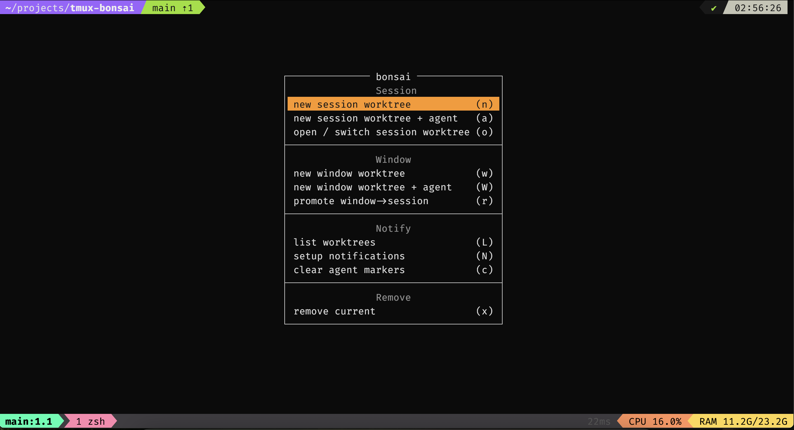

# 🌳 tmux-bonsai

> Cultivate parallel git worktrees and AI agents across branches — without leaving tmux.

**tmux-bonsai** turns your tmux server into a workbench for a git **worktree-per-task**
workflow. Spin up an isolated worktree for any branch, drop it into its own tmux session,
and launch an AI coding agent (Claude Code, opencode, …) right where the work lives. Jump
between tasks with a single `fzf` picker, and promote a scratch window into its own session.
Like tending a bonsai: many small branches, each shaped deliberately, all in view at once.

Track agents in a live cross-session board and receive desktop or terminal alerts when
they finish, need input, or fail. Open **Notifications → setup / repair agent hooks**
from the menu to connect your agents. See [notifications](docs/notifications.md),
[the agent board](docs/board.md), and [orchestration](docs/orchestration.md).

Bring your own layout: bonsai never enforces one — shape each session with a separate
plugin (tmuxinator, smug) or a tmux `session-created` hook (see [Layout](#layout)).

<p align="center">
  
</p>

[worktrunk](https://worktrunk.dev) (`wt`) is the git engine; the plugin owns all the
tmux orchestration. **No worktrunk config / hooks required** — every `wt` call is made
with `--no-hooks --no-cd`, and the plugin creates the session, switches the client, and
tears things down itself.

## Requirements

- tmux **>= 3.2** (`display-popup`)
- [worktrunk](https://worktrunk.dev) (`wt`) on `PATH`
- `git`, `awk`, `sed` (standard)
- `fzf` **>= 0.40** and `curl` — for live agent-board refresh (older fzf supports manual reload)
- `jq` — for agent payloads, settings installers, and JSON output
- your agent CLI (`claude`, `opencode`, ...) — for "new + agent"

That's it. No `~/.config/worktrunk/config.toml`, no shell functions.

## Install

### TPM
```tmux
set -g @plugin 'PedroLaRosa/tmux-bonsai'
run '~/.tmux/plugins/tpm/tpm'   # keep this last — @plugin lines go above it
```
`prefix + I` to fetch. No clone needed; TPM installs into `~/.tmux/plugins/tmux-bonsai/`.

Pin a release instead of tracking the default branch:
```tmux
set -g @plugin 'PedroLaRosa/tmux-bonsai#v1.0.0'
```

### Local / no TPM
```tmux
run-shell '~/code/tmux-bonsai/bonsai.tmux'
```
`tmux source-file ~/.tmux.conf` to reload.

The local installer copies all hook adapters and can expose the CLI:

```sh
./install.sh ~/.tmux/plugins/tmux-bonsai --bin
bonsai doctor
```

## Use

`prefix + W` opens the menu:

| Key | Action |
|-----|--------|
| n | New worktree → its own session |
| a | New worktree + launch the agent in that session |
| o | Open / switch — fzf over worktrees **and** local/remote branches (with log preview) |
| w | New worktree as a **window** in the current session |
| O | Open / switch — like `o`, but jumps to (or opens) the worktree as a **window** in the current session |
| r | Promote the current window-worktree into its own session |
| \| | Split the current pane **right** and launch the agent (same worktree) |
| _ | Split the current pane **down** and launch the agent (same worktree) |
| d / D / B | Agent board as a popup / window / side pane |
| j / J | Next agent that needs you / previous session |
| f / u | Activity feed / mark current agent unread |
| N | Notification settings, setup, test, and doctor |
| L | List all worktrees (`wt list --full`) |
| x | Remove the current worktree (auto-detects session vs window) |

The "open / switch" picker handles all three navigation cases in one place: an existing
worktree (jumps to its session), a local branch with no worktree yet, or a teammate's
remote branch (worktrunk checks it out into a fresh worktree, then the plugin builds the
session).

**Backing out returns to the menu.** Cancelling a popup action — ESC in the
`o`/`O` picker, an empty prompt (just Enter) in `n`/`a`/`w`, or any key to close the
informational `L` view — re-opens the bonsai menu instead of dropping you
back in your pane. Completing an action (creating or switching a worktree) does
not re-open it. The menu thus behaves like a navigable hierarchy rather than a
one-shot launcher.

## Options

```tmux
set -g @bonsai-key   'W'        # menu key (under prefix)
set -g @bonsai-agent 'claude'   # 'opencode', 'opencode run', ...
```

## Layout

bonsai creates a **bare single-window session** at the worktree path and switches to it —
nothing more. Shape it however you like; bonsai never overrides your choice:

```tmux
# example: split every new session into editor + side terminal
set-hook -g session-created 'split-window -h ; select-pane -L'
```

For richer, per-project layouts use a dedicated tool like
[tmuxinator](https://github.com/tmuxinator/tmuxinator) or
[smug](https://github.com/ivaaaan/smug).

## How it stays config-free

| Step | Who does it |
|------|-------------|
| create branch + worktree, copy `.env`, remove | `wt` (`--no-hooks --no-cd`) |
| find the worktree path | `git worktree list --porcelain` |
| create session, switch client, kill session/window | the plugin |

So worktrunk never needs to know about tmux, and tmux never needs a worktrunk config file.


## Agent notifications and dashboard

Notifications and agent tracking are built in. Hooks are available for Claude Code,
OpenCode, Codex, Gemini, Cursor, Copilot, and Droid. Run setup from the notification
menu, or install the adapters you want:

```sh
bonsai hooks install claude codex
bonsai notify test
bonsai board --watch
bonsai list --json
```

The test asks whether a banner actually appeared and records your answer. Delivery
logs distinguish disabled categories, focus suppression, cooldown, cancelled grace
windows, missing backends, and delivery failures. `bonsai feed` explains those decisions.

```tmux
set -g @bonsai-notify-focus strict       # strict | attached | off
set -g @bonsai-notify-backend auto       # desktop, osc, command, or comma-separated fan-out
set -g @bonsai-notify-preview off        # hide prompt and answer text in banners
set -g @bonsai-status on                # optional counts in status-right
set -g @bonsai-window-glyphs on          # optional severity glyph on windows
```

Menu preferences persist in `~/.config/tmux-bonsai/settings.tmux`. Existing
`@bonsai-*` settings at plugin load are pinned and take precedence on reload.
See the [full guide](docs/notifications.md) and [provider details](docs/hooks.md).

**Migrating from tmux-agent-notify:** remove the companion plugin and its managed
agent hooks after setting up bonsai to avoid duplicate alerts. Existing status-line
snippets using `@agent_state` and `@agent_state_ts` remain compatible. `bonsai doctor`
reports companion hook leftovers; it does not alter them automatically.

## Optional: key-table instead of a menu

```tmux
bind -T worktree n display-popup -d "#{pane_current_path}" -E "~/code/tmux-bonsai/scripts/new.sh"
bind -T worktree o display-popup -d "#{pane_current_path}" -E "~/code/tmux-bonsai/scripts/switch.sh"
bind -T worktree x confirm-before -p "remove? (y/n) " "run-shell '~/code/tmux-bonsai/scripts/remove.sh'"
bind w switch-client -T worktree
```

## Notes

- Teardown runs via `run-shell` (tmux server context), not inside the worktree's shell,
  so removing the session you're in is safe.
- The fragile part of any tmux plugin is `display-menu` argument quoting; test each entry
  if you edit `scripts/menu.sh`.
