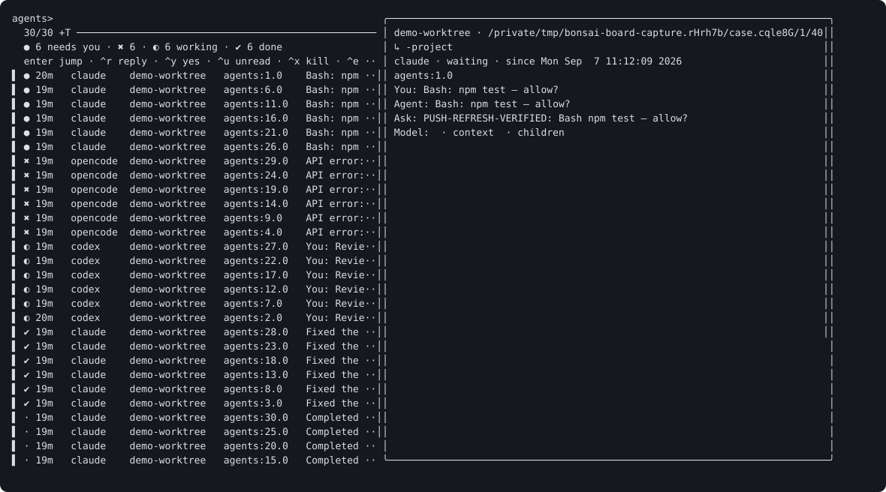

# Agent board

Open **Agents → agent board** from `prefix + W`, or run `bonsai board` in a terminal. The popup closes when you jump; its Escape key returns to the menu. `bonsai board --window` creates or selects a dedicated board window; invoking it while that window is current closes it. `bonsai board --side` toggles a 44-column pane in the current window. Both persistent modes keep the board open when you jump.



A board can look like this (its preview also shows the live terminal tail):

```text
● 2 needs you · ✖ 1 · ◐ 2 working · ✔ 1 done · 0 idle
agents>
> ● 12m  claude    fix-auth        api:2.1  Bash: npm test — allow?
  ● 3m   opencode  payments        pay:1.0  Which database should I use?
  ✖ 41s  claude    infra-cleanup   ops:0.1  API error 529
  ◐ 7m   claude    search-index    api:3.0  Using Edit: src/index.ts
  ◐ 2m   codex     docs-refresh    docs:0.0 You: rewrite the README
  ✔ 5m   claude    flaky-tests     api:1.0  Fixed the retry race
  ○ 3h   claude    spike-cache     lab:0.1  exited · resumable
```

Waiting agents come first, oldest first, so a long-running queue cannot hide an old question. Errors, working agents, unread completions, reviewed/idle agents, exited agents, and unknown agents follow. A completion moves to the idle display bucket after `@bonsai-idle-after` (30 minutes by default). Acknowledgement controls the unread flag independently.

| Key | Action |
| --- | --- |
| Enter | Jump to the exact pane, including another session |
| Ctrl-R | Type a reply and confirm the literal text before sending |
| Ctrl-Y | Confirm sending `y` and Enter to a waiting agent |
| Ctrl-U | Toggle acknowledgement/unread |
| Ctrl-X | Confirm interrupting the agent, then optionally close its pane |
| Ctrl-E | Resume an exited Claude, opencode, or Codex session |
| Ctrl-N / Ctrl-B | Move to the next / previous waiting row |
| Ctrl-A | Include shells and worktrees that have no open pane |
| Ctrl-L | Cycle state, newest-first, and oldest-first order |
| Ctrl-P | Toggle the live preview |
| Ctrl-O | Open notification settings |
| ? | Show help |
| Escape | Return to the menu or quit the persistent board |

Search matches agent, branch, location and preview in the full board, and branch and preview in the compact board. An offline worktree row opens its session. Replies use tmux literal input; strings such as `C-c` and `$(...)` are text, not tmux keys or commands executed by bonsai. Input is still delivered to the program running in the destination pane, so review the destination before confirming.

Each board registers an authenticated local fzf listener. Accepted hook events push a reload and preview refresh, and a two-second timer updates ages, headers and terminal output. Dead listeners are removed automatically. Each board has its own shell-visibility and sort settings. Registrations and cycling cursors are scoped to the tmux socket, so multiple servers can share a state directory. fzf 0.40 or newer and curl provide the complete board, including dynamic headers; older versions use Ctrl-R for manual reload. Cursor tracking is enabled from fzf 0.39.

`bonsai next` cycles waiting agents, then errors, then unseen completions. The same action is available with `prefix + W j`. `bonsai feed` shows recent transitions and notification decisions; Ctrl-W shows why a notification was suppressed, and Enter jumps to its pane. `bonsai feed --tail` streams events, and `--json` exposes the records to scripts.

To add counts to an existing status theme, insert this command substitution in its `status-right` format:

```tmux
# Replace the path with your clone or TPM installation.
set -ag status-right ' #(/absolute/path/tmux-bonsai/scripts/status.sh)'
```

`bonsai settings set status on` enables the managed segment. It uses nonzero waiting, error, working and unread-done counts and marks unverified notifications with `!` (`🔕` with emoji glyphs). `bonsai settings set glyphs ascii` selects ASCII symbols. The plugin also exposes `#{E:@bonsai-window-glyph}` for window-status formats; enable `window-glyphs` to have it inserted automatically.

The collector uses one tmux snapshot, one process snapshot, and a cache per working directory keyed by its resolved Git HEAD. Once an agent process has been observed, returning to its shell displays it as exited. A pane with hook metadata but no observed process is allowed to remain fresh until `stale-after`, avoiding false exits during CLI startup. The default stale threshold is six hours. Shell panes are hidden unless requested. State cache and listener files live under `@bonsai-state-dir` and are private to your user.

Run `bash tests/manual/board-capture.sh` to reproduce the 30-pane collector benchmark, verify a live push refresh, and regenerate the terminal capture. Timings are printed for the current machine.

The final local macOS run with 30 mixed panes measured a 102 ms warm median collector refresh and a 291 ms visible push refresh. Cold collection took 135 ms; warm samples ranged up to 143 ms. This run exceeded the plan's 100 ms collector and 200 ms push targets. Earlier runs reached 97 ms and 123 ms, respectively; startup Git discovery and host process load affect the results. See [validation and limits](notifications-validation.md).
