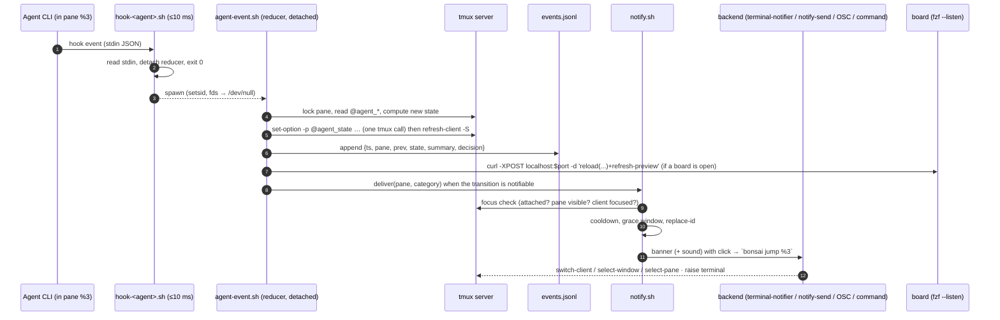
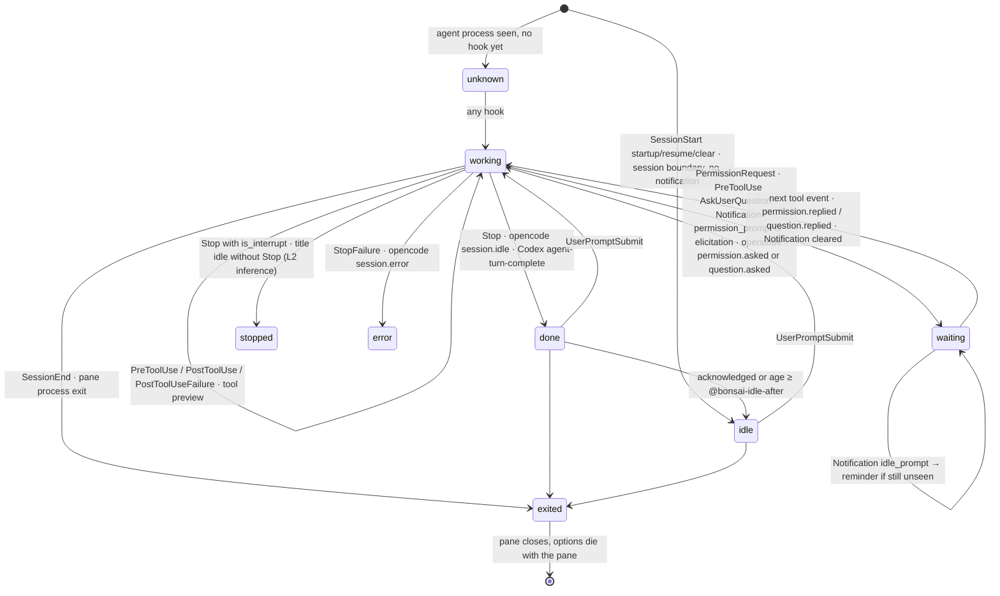

# tmux-bonsai · Agent notifications & live agent board — implementation plan

| | |
|---|---|
| **Status** | P0–P5 implemented. See [validation, measurements and manual checks](notifications-validation.md). |
| **Scope** | Fold agent notifications back into tmux-bonsai as a first-class *Notifications* section, add a live *Agent board* (dashboard) that can run in a popup, a window, or a side pane, and add the multi-agent primitives (jump / reply / wait / send / spawn) a tmux user needs to run many agents at once. |
| **Quality bar** | [stablyai/orca](https://github.com/stablyai/orca) `da48ad2` (its notification pipeline, agent-status model, Agent Dashboard and Agents feed). Everything Orca does for notifications and agent tracking has a tmux-native equivalent here, plus the things only a terminal multiplexer can do well (see §3). |
| **Targets** | tmux ≥ 3.2 (popups); tmux ≥ 3.3 unlocks popup titles/borders and `allow-passthrough`; verified on 3.4. bash 3.2 (macOS stock) — no associative arrays, no `mapfile`. `jq`, `fzf ≥ 0.38` (manual refresh); fzf ≥ 0.40 and `curl` for live refresh with dynamic headers. |
| **Supersedes** | The companion plugin `tmux-agent-notify` (extracted in #19). Its `@agent_state` / `@agent_state_ts` pane options stay backward compatible; everything else is redesigned here. (The companion repo was not reachable from the planning session; the design below is based on the #19 commit description and Orca, not on its current code.) |

## Table of contents

0. [TL;DR](#0-tldr)
1. [Goals, non-goals, UX principles](#1-goals-non-goals-ux-principles)
2. [What Orca does (the reference)](#2-what-orca-does-the-reference)
3. [Feature matrix: Orca → bonsai](#3-feature-matrix-orca--bonsai)
4. [Architecture](#4-architecture)
   - 4.1 [Components and data flow](#41-components-and-data-flow)
   - 4.2 [State model](#42-state-model)
   - 4.3 [Agent adapters (hook installers)](#43-agent-adapters-hook-installers)
   - 4.4 [Notification pipeline](#44-notification-pipeline)
   - 4.5 [Acknowledgement, unread and focus](#45-acknowledgement-unread-and-focus)
   - 4.6 [Agent board (dashboard)](#46-agent-board-dashboard)
   - 4.7 [Feed, next-needs-you, status line, window glyphs](#47-feed-next-needs-you-status-line-window-glyphs)
   - 4.8 [CLI surface and orchestration primitives](#48-cli-surface-and-orchestration-primitives)
   - 4.9 [Menus, settings, setup wizard, doctor](#49-menus-settings-setup-wizard-doctor)
5. [Configuration reference](#5-configuration-reference)
6. [File layout](#6-file-layout)
7. [Phased delivery](#7-phased-delivery)
8. [Test plan](#8-test-plan)
9. [Portability and performance constraints](#9-portability-and-performance-constraints)
10. [Risks and open questions](#10-risks-and-open-questions)
- [Appendix A — Hook event → state mapping per agent](#appendix-a--hook-event--state-mapping-per-agent)
- [Appendix B — Notification backend cookbook](#appendix-b--notification-backend-cookbook)
- [Appendix C — System notification settings deep links](#appendix-c--system-notification-settings-deep-links)
- [Appendix D — Orca source index](#appendix-d--orca-source-index)
- [Appendix E — Facts verified during planning](#appendix-e--facts-verified-during-planning)

---

## 0. TL;DR

- **One state store: tmux pane options.** Every agent pane carries `@agent_state`, `@agent_state_ts`, `@agent_type`, `@agent_prompt`, `@agent_msg`, `@agent_ask`, … set by a single reducer script. Pane options die with the pane, are readable from status-line formats, and need no daemon.
- **Three layers of evidence, like Orca:** (1) agent-native hooks (Claude Code, opencode, Codex, then Gemini/Cursor/Copilot/Droid), (2) terminal-title heuristics via the `pane-title-changed` hook (spinner glyphs = working, `✳` = Claude idle, …), (3) terminal bell / silence. Hooks win; the others fill gaps and catch missed transitions.
- **Orca's notification gates, in the same order:** master switch → category switch → *suppress-while-focused* → per-pane cooldown → *done* grace window (a milestone "done" that resumes within 1.5 s is cancelled) → backend delivery → replace-by-id → sound. Every decision is logged with a reason, so "why didn't I get pinged?" has an answer (`bonsai feed`).
- **Backends:** `terminal-notifier`/`alerter`/`osascript` (macOS), `notify-send`/`dunstify`/`gdbus` (Linux), terminal-native OSC 99/777/9 through tmux passthrough (works over SSH), and a user command hook (ntfy/Pushover/Slack — the tmux answer to Orca's mobile app). Clicking a banner jumps to the exact session/window/pane and raises the terminal.
- **Notifications section in the menu:** live toggles (rendered from tmux options, persisted to `~/.config/tmux-bonsai/settings.tmux`), *Send test notification* (same pipeline as real events, then asks "did you see it?" and records the evidence), *Open system notification settings* (per-OS deep link), *Setup / repair agent hooks* wizard, *Doctor*.
- **Agent board:** an fzf-driven live board (`● needs you · ◐ working · ✔ done · · idle`) with search, live pane preview, jump, reply, mark-unread, kill, resume. Runs as a popup (`prefix+W d`), a dedicated window (`D`), or a 44-column side pane (`B`) that refreshes itself on every event (fzf `--listen`) plus a timer.
- **Many-agents ergonomics Orca lacks:** one key cycles through agents that need you (`j`), reply from the board without switching, `bonsai wait/send/spawn/list --json` for scripting and orchestration, per-category sounds, escalation reminders, ASCII/unicode/emoji glyph sets.

---

## 1. Goals, non-goals, UX principles

### Goals

1. Know, at any time and from any session, which agents are **working**, which **need you** (permission / question / idle prompt), which are **done** and unreviewed, and which **failed** — without visiting each pane.
2. Get a desktop (or phone, or terminal-native) notification for every transition that matters, with a body that tells you what happened, and a click that lands on the pane.
3. Manage notifications from inside tmux: turn categories on/off, pick sounds, **test** the OS notification path, **open the OS settings** when it is blocked, wire agents' hooks, diagnose.
4. A live board of all agents that can stay open in its own pane and always refreshes.
5. Keep bonsai's character: no daemon, no config file required, everything reachable from `prefix + W`, cancelling returns to the menu, tmux.conf remains the source of truth for options.

### Non-goals (v1)

- A mobile app, a relay server, or any network service. (A user command hook covers push services.)
- Reading agent transcripts to build a chat UI. (The board shows the last prompt/answer preview that hooks already carry.)
- Replacing the agent's own permission UI. Hooks are observe-only: they never allow/deny.
- Windows-native (non-WSL) support. WSL gets a documented backend.

### UX principles (apply to every phase)

- **Honest state.** Never claim "notification sent" when the backend only *accepted* it. Show verification evidence ("verified 2 h ago via terminal-notifier") and a `🔕`/`!` marker when notifications are on but unverified or the last test failed.
- **Never block the agent.** Hook scripts return in < 10 ms; all work is detached. Claude Code waits for hooks synchronously (PreToolUse blocks tool execution), so slowness here is felt on every tool call.
- **Zero config to get value.** Defaults work: install → run *Setup* once → done. Options exist for taste, not for correctness.
- **Every screen has a way back.** Popups return to the menu on cancel (existing `@bonsai-back` contract). Destructive actions (kill, send text to an agent) confirm.
- **Quiet by default, loud when it matters.** Distinct sounds and glyphs for *needs you* vs *finished* vs *error*; nothing for tool churn; one banner per pane at a time (replace-by-id); focus suppression when you are already looking.
- **tmux-native rendering.** Single-width unicode glyphs by default (emoji misalign status lines on many terminals); `@bonsai-glyphs unicode|emoji|ascii`.
- **Scriptable.** Everything the menu does is a `bonsai …` CLI subcommand; the board is a view over `bonsai list --json`.

---

## 2. What Orca does (the reference)

Condensed from Orca `da48ad2` (paths in Appendix D). This is the behaviour to match.

**State model** (`src/shared/agent-status-types.ts`): per pane, `state ∈ {working, blocked, waiting, done}` plus display states `idle` (done, acknowledged or ~30 min old), `interrupted` (done via cancel), `monitoring` (done but background tasks alive), `unverifiable` (no recent evidence). Fields: `prompt` (last user prompt), `stateStartedAt`, `updatedAt`, `agentType`, `toolName`/`toolInput` (live in-flight tool preview), `interactivePrompt` (full AskUserQuestion JSON), `lastAssistantMessage` (≤ 8 KB), `subagents[]`, `stateHistory[]` (cap 20), flags `interrupted`, `sessionBoundary` (SessionStart lands as a non-notifying `done`).

**Evidence sources, by priority:** native hooks (Claude/Codex/Gemini/Cursor/Copilot/Droid/opencode plugin/…) → OSC terminal-title heuristics (`agent-title-core.ts`: braille `U+2800–28FF` or quarter-circle `U+25D0–25D3` spinner = working; `✳` = Claude idle; Gemini `✦`/`⏲` working, `◇` idle, `✋` permission; strong keywords `ready|idle|done` vs `working|thinking|running` with word boundaries) → process exit → interrupt inference (Esc/Ctrl-C while working and no Stop hook ⇒ `done, interrupted`) → terminal BEL (stateful detector that ignores BEL inside OSC).

**Claude hook mapping** (`providers/claude-events.ts`, `claude/hook-settings.ts`): registers SessionStart, UserPromptSubmit, Stop, StopFailure, SubagentStart, SubagentStop, TeammateIdle, PreToolUse(*), PostToolUse(*), PostToolUseFailure(*), PermissionRequest(*), PostCompact. Mapping: UserPromptSubmit / PreToolUse / PostToolUse / PostToolUseFailure → `working`; PermissionRequest or PreToolUse of `AskUserQuestion` → `waiting`; Stop / StopFailure → `done` (`is_interrupt` ⇒ interrupted); SessionStart(startup|resume|clear) → `done` + `sessionBoundary`; PostCompact(manual) → `done` boundary; PreCompact deliberately not registered. Stop's `last_assistant_message` (or transcript tail) becomes the notification body.

**Notification dispatch** (`src/main/ipc/notifications.ts`, `notification-options.ts`, renderer `use-notification-dispatch.ts`): title `"<worktree> - <Agent> finished|needs input|stopped"` (prefix `<repo> / ` when several repos have active agents), body = last assistant message (≤ 180 chars) → `"Using <tool>: <input>"` → fallback. Gates in order: light tray attention dot → `enabled` → per-source toggle (`agentTaskComplete`, `terminalBell`) → mobile fan-out (5 s cooldown per worktree) → `suppressWhenFocused && isActiveWorktree && windowFocused` → 5 s cooldown per worktree (test bypasses) → `Notification.isSupported` → macOS permission readout (blocked ⇒ in-app toast with *Open System Settings*). Completion has a 1.5 s quiet window (`HOOK_DONE_QUIET_MS`) so a milestone done that resumes is cancelled; Codex attention debounced 1.5 s. Notification id `agent:<worktree>:<pane>:<stateStartedAt>` — a new one closes the previous; acknowledging (focusing the pane) dismisses it. Click → activate worktree, focus exact pane, flash it.

**Settings pane** (`settings/NotificationsPane.tsx`): Enable · Agent Task Complete · Terminal Bell · Sound (system / 9 built-ins / custom file + volume) · Suppress While Focused · **Send Test Notification** (uses `requireDisplayConfirmation`; outcomes delivered / not-displayed / not-sent; failure toast has *Open Settings*). macOS permission card (`mac-notification-permission-card.tsx`): states checking / awaiting-permission / enabled / blocked, polled every 2.5 s for ~3 min, backed by a Swift helper reading `UNUserNotificationCenter` authorization (Electron cannot). System settings deep link (`notification-system-settings-link.ts`): `x-apple.systempreferences:com.apple.Notifications-Settings.extension?id=<bundle>`; Windows `ms-settings:notifications`; Linux none.

**Unread model:** worktree + pane marked unread unless the exact pane is visible in a focused window; auto-ack on focus; right-click *Mark unread*; Dock badge count; tray attention dot; sidebar bolds unread.

**Agent Dashboard** (`dashboard-popout/`, `shared/dashboard-snapshot.ts`): kanban columns **Needs You / Working / Done / Idle** (idle hidden by default, ≈ 30 min); cards: agent icon, conversation name or worktree, state glyph, `You: <last prompt>`, `<Agent>: <last message>` (or task), amber ask summary when blocked, green tint when done and unseen, footer repo icon · host badge · worktree · PR pill · age (since finish, else since start); click opens the live terminal; subagents expandable; search + filters (project, workspace status, PR state); most-recently-changed first; in-window or pop-out; shortcut to toggle.

**Agents feed** (`activity/`): chronological threaded feed of completions, blocking questions, worktree creation; unread badge; running agents pinned on top; Cmd+F filter.

**Quick open:** recent chats ranked needs-you → done → idle with digit shortcuts.

**Adjacent:** agent hibernation (sleep done agents after 30 min, resume via `claude --resume <id>` / `codex resume <id>`); `orca terminal wait --for tui-idle`; orchestration mailbox CLI; `orca agent hooks on|off|status`; Claude `statusLine` script feeding usage.

---

## 3. Feature matrix: Orca → bonsai

| Capability | Orca | bonsai (this plan) | Better for a tmux user because |
|---|---|---|---|
| Agent state per pane (working / needs you / done / error) | hooks + title + process | same three layers; pane options as store (§4.2) | readable from any status-line format; no daemon |
| Native hooks: Claude Code | ✓ | ✓ P1 | |
| Native hooks: opencode | ✓ (plugin) | ✓ P3 (plugin) | |
| Native hooks: Codex | ✓ (hooks.json) | ✓ P3 (`notify` first, hooks.json when trust model verified) | |
| Gemini / Cursor / Copilot / Droid | ✓ | P4 adapters (Appendix A) | |
| Any other agent | title heuristics | title hook + bell + silence (§4.2 L2/L3) | |
| Desktop notification, rich body | ✓ | ✓ P1 | |
| Click → exact pane | ✓ | ✓ P1 (`bonsai jump`, cross-session, raises terminal) | |
| Suppress when focused | ✓ | ✓ (`strict` uses tmux client focus events) | |
| Cooldown / replace-by-id / dismiss on ack | ✓ | ✓ | |
| Done grace window (cancel milestone dones) | ✓ 1.5 s | ✓ configurable | |
| Sounds | 1 sound for all | per category (finished / needs-you / error), system names | more agents ⇒ you need to *hear* the difference |
| Test notification with outcome | ✓ (display confirmation) | ✓ + "did you see it?" evidence + click test | |
| Permission / blocked detection | Swift helper | evidence-based (test result, daemon probe, DND probe) + doctor | no signed helper possible from a shell plugin |
| Open OS notification settings | macOS, Windows | macOS, Windows/WSL, GNOME/KDE/XFCE/dunst/mako (Appendix C) | |
| Unread + auto-ack on focus + mark unread | ✓ | ✓ | |
| Header bell / Dock badge | ✓ | status-line counts segment (clickable) + optional terminal badge/bell | |
| Dashboard | kanban, popout | fzf board: popup / window / side pane, live preview, search | fits in a 44-col pane next to your work |
| Reply to an agent from the dashboard | mobile only | ✓ `ctrl-r` reply, `ctrl-y` "yes" | |
| Next agent that needs you, one key | quick-open digits | `prefix+W j` cycles, oldest first | |
| Activity feed | ✓ | ✓ `bonsai feed` (with *why not notified* reasons) | greppable JSONL |
| Remote/SSH | SSH worktrees / remote server | terminal-native OSC notifications over SSH + user command hook (ntfy…) | tmux users live over SSH |
| Mobile push | native app | user command hook (ntfy, Pushover, Telegram) | |
| Scripting / orchestration | `orca terminal wait`, mailbox | `bonsai wait / send / spawn / fanout / list --json / capture` | plain shell |
| Resume exited agent | hibernation | `bonsai resume` (session id captured from hooks) P5 | |
| Model / context % per pane | statusline usage | optional Claude statusLine adapter P5 | |

---

## 4. Architecture

### 4.1 Components and data flow



Everything is a short-lived process. The only long-lived things are the tmux server (state) and an open board (fzf).

**Attribution.** Hooks run inside the agent's pane, so `$TMUX_PANE` is the pane and `$TMUX` (`socket,pid,session`) names the server. Every script derives the socket with `${TMUX%%,*}` and calls `tmux -S "$socket"`, so multiple servers and nested/SSH tmux both work. A hook without `$TMUX_PANE` exits 0 silently (agent started outside tmux). Claude backgrounded sessions (`$CLAUDE_JOB_DIR` set) are skipped, as Orca does.

### 4.2 State model

#### Pane options (source of truth)

| Option | Values / format | Notes |
|---|---|---|
| `@agent_state` | `working` · `waiting` · `done` · `error` · `stopped` · `idle` · `exited` · `unknown` | **compatible** with tmux-agent-notify (`waiting/done/error/working`). `stopped` = done via interrupt. `idle` = done and acknowledged, or older than `@bonsai-idle-after`. `exited` = agent process gone, pane alive. `unknown` = agent process detected but no hooks yet. |
| `@agent_state_ts` | epoch seconds | when the *state* last changed (tool pings do not move it) — compatible. |
| `@agent_seq` | integer | monotonically increasing per pane; reducer rejects out-of-order writes. |
| `@agent_type` | `claude` · `opencode` · `codex` · `gemini` · `cursor` · `copilot` · `droid` · `<other>` | |
| `@agent_prompt` | ≤ 160 chars, single line | last user prompt (UserPromptSubmit; opencode user text part). |
| `@agent_msg` | ≤ 240 chars | last assistant message preview (Stop `last_assistant_message`, transcript tail fallback, opencode assistant text part, Codex `last-assistant-message`). |
| `@agent_ask` | ≤ 160 chars | pending question / permission summary (`Bash: npm test`, `Question: Which DB…`). Set on `waiting`, cleared on leaving it. |
| `@agent_tool` | ≤ 120 chars | in-flight tool + input preview (PreToolUse), cleared on PostToolUse/Stop. Only when `@bonsai-hooks-tool-events on`. |
| `@agent_session` / `@agent_transcript` | provider session id / path | enables `bonsai resume`. |
| `@agent_seen_ts` | epoch seconds | last acknowledgement; **unseen ⇔ `@agent_seen_ts < @agent_state_ts`**. |
| `@agent_notify_id` / `@agent_notified_ts` | backend banner id / epoch | replace-by-id, dismiss on ack, cooldown. |
| `@agent_title_state` | `working` · `idle` · `permission` | Layer-2 classification of the pane title (see below). |
| `@agent_launch_ts` | epoch | set by bonsai when *it* launches the agent (`new.sh agent`, `split.sh`), so the board shows *starting* before the first hook. |
| `@agent_children` | integer | live subagents/teammates (SubagentStart/Stop roster); keeps the pane `working` while > 0 (P3). |
| `@agent_model` / `@agent_ctx` | `Opus` / `42` | optional, from Claude statusLine adapter (P5). |

Window mirror: the reducer also sets `@agent_state` on the pane's **window** to the most severe pane state (`waiting > error > working > done > idle`) so a one-line `window-status-format` glyph keeps working (§4.7).

Value hygiene: strip control characters and newlines, truncate on UTF-8 boundaries, pass values as argv (never through a format string). All writes for one event go in a **single** `tmux` invocation chained with `\;` (verified), followed by `refresh-client -S 2>/dev/null`.

#### Events log

`$XDG_STATE_HOME/tmux-bonsai/events.jsonl` (default `~/.local/state/tmux-bonsai/`), append-only, rotated at 1 MB to `events.1.jsonl`. One line per accepted transition and per notification decision:

```json
{"ts":1788716385,"pane":"%3","session":"api-server","window":"fix-auth","cwd":"/w/api/fix-auth","branch":"fix-auth","repo":"api","agent":"claude","event":"PermissionRequest","prev":"working","state":"waiting","ask":"Bash: npm test","prompt":"add retries to the client","notify":{"category":"input","decision":"delivered","backend":"terminal-notifier","id":"bonsai-%3"}}
```

`decision ∈ delivered | suppressed-focus | cooldown | grace-cancelled | category-off | disabled | backend-missing | failed | test`. The feed (§4.7) and `bonsai doctor` read this file; nothing else depends on it.

#### Settings persistence

Runtime toggles (menu, `bonsai settings set`) write `set -g @bonsai-… value` lines to `~/.config/tmux-bonsai/settings.tmux` **and** set the option live. `bonsai.tmux` applies, in order: built-in defaults → `settings.tmux` → nothing (tmux.conf values are already set when the plugin loads, so they win). Implementation: `bonsai_default OPT VAL` sets only when `tmux show -gqv OPT` is empty; on load, record which `@bonsai-*` options were already present as `@bonsai-pinned` so the menu can label them *(pinned in tmux.conf)* and explain that a toggle lasts until reload.

#### State machine (per pane)



Notifiable transitions (categories): `→ waiting` = **input**, `→ done` = **finished**, `→ error` = **error**, `→ stopped` = **finished** (title "stopped", no sound by default), terminal BEL = **bell**. Session boundaries and tool churn never notify.

#### Layer 2 — terminal-title evidence (any agent, event-driven, ~free)

Verified on tmux 3.4: `pane-title-changed` fires on every OSC title update and `#{m/r:…}` regex formats match multibyte glyphs (`#{m/r:(⠋|⠙|⠹|⠸|⠼|⠴|⠦|⠧|⠇|⠏|◐|◓|◑|◒|✦|⏲),#{pane_title}}` → `1`). Spinner frames change every ~80 ms, so the hook must **not** spawn a process per frame. Register:

```tmux
set-hook -g pane-title-changed {
  if-shell -F '#{&&:#{==:#{@bonsai-titlewatch},on},#{!=:#{@agent_title_state},#{?#{m/r:(⠋|⠙|⠹|⠸|⠼|⠴|⠦|⠧|⠇|⠏|◐|◓|◑|◒|✦|⏲),#{pane_title}},working,#{?#{m/r:(✳|◇|✋),#{pane_title}},idle,none}}}}' \
    'run-shell -b "<plugin>/scripts/title.sh #{pane_id}"'
}
```

The format classifies the title inside tmux (no fork) and only spawns `title.sh` when the classification differs from the stored `@agent_title_state`. `title.sh` re-classifies with the full heuristic (Orca's keyword rules with word boundaries, Gemini glyphs, Pi/Grok/opencode shapes — Appendix A) and:

- hookless agent (`@agent_type` empty, agent process present): drives `@agent_state` directly (`working` ↔ `idle`, `✋` ⇒ `waiting`), so any agent that animates its title gets working/idle tracking and finished notifications;
- hooked agent: only resolves conflicts — hooks say `working` but title has been idle for `@bonsai-title-settle` (3 s) ⇒ `stopped` (interrupt without a Stop hook), the same inference Orca does from keystrokes;
- never *downgrades* a fresh hook state (< 3 s old).

`titlewatch` is on by default; the hook is the whole cost.

#### Layer 3 — bell and silence

- `alert-bell` hook → `notify.sh bell #{pane_id}` when `@bonsai-notify-on-bell on`; dropped if a hook event for the same pane happened within the cooldown (Claude with `preferredNotifChannel: terminal_bell` rings *and* fires hooks).
- Optional per-window `monitor-silence N` + `alert-silence` hook for agents with neither hooks nor titles (`bonsai watch-silence <window> 20`); documented, not default.

#### Liveness

`pane-exited` (verified) → reducer marks nothing (the pane is gone and its options with it). `SessionEnd` hook or the board's process scan (`ps -eo pid,ppid,comm,args` once per refresh, walk descendants of `pane_pid`) ⇒ `exited` while the pane's shell survives; `exited` rows offer *resume* when `@agent_session` is known. Stale rule: hook state older than `@bonsai-stale-after` (default 6 h) with no agent process ⇒ treated as `exited`.

### 4.3 Agent adapters (hook installers)

One directory, one contract: `scripts/adapters/<agent>.sh install|status|remove|explain`. Each prints a status record `agent state config_path detail` with `state ∈ installed | partial | not_installed | error | skipped(cli_not_found|unsupported)` — Orca's `AgentHookInstallStatus`. Managed entries are recognised by the absolute path of the installed hook script (`createManagedCommandMatcher` in Orca), so install is idempotent, `status` detects **path drift** (plugin moved from a clone to TPM's dir ⇒ "hook points to a missing script" ⇒ *repair*), and `remove` deletes only ours. Every write backs up the target (`settings.json.bak-<ts>`) and validates JSON with `jq` before replacing (temp file + `mv`, never `sed -i`).

Hook script contract (all agents): read stdin fully, detach the reducer with **all three fds redirected** (`</dev/null >/dev/null 2>&1`, `setsid` where available) — otherwise the agent waits for the pipe to close and the hook *appears* to hang — then `exit 0`. Never print to stdout (Claude interprets JSON on stdout; Cursor requires a JSON reply, so its adapter prints the neutral `{}` / `{"continue":true}` and **never** `{"permission":"allow"}`).

Priority and mapping details are in Appendix A. Summary:

| Agent | Where | Events registered | Phase |
|---|---|---|---|
| Claude Code | `~/.claude/settings.json` `hooks` (merged with `jq`) | SessionStart, UserPromptSubmit, PreToolUse(*), PostToolUse(*), PostToolUseFailure(*), PermissionRequest(*), Notification, Stop, StopFailure, SubagentStart, SubagentStop, PostCompact, SessionEnd; `timeout: 5` | P1 |
| opencode | `~/.config/opencode/plugins/tmux-bonsai.js` (global plugin dir; load order verified in opencode docs) | `session.created`, `session.status`, `session.idle`, `session.error`, `permission.asked/replied`, `question.asked/replied/rejected`, `message.updated`, `message.part.updated` (text parts, throttled), `tool.execute.before/after` | P3 |
| Codex | `~/.codex/config.toml` `notify = ["<script>"]` (turn complete + last message); later `~/.codex/hooks.json` (SessionStart, UserPromptSubmit, PreToolUse, PermissionRequest, PostToolUse, SubagentStart, SubagentStop, Stop) | P3 (`notify`), P4 (hooks.json after verifying Codex's hook trust model) |
| Gemini CLI | `~/.gemini/settings.json` hooks | BeforeAgent, AfterAgent, BeforeTool, AfterTool | P4 |
| Cursor CLI | `~/.cursor/hooks.json` | beforeSubmitPrompt, stop, preToolUse, postToolUse, postToolUseFailure, beforeShellExecution, beforeMCPExecution, afterAgentResponse | P4 |
| Copilot CLI | `~/.copilot/hooks.json` | SessionStart, SessionEnd, UserPromptSubmit, PreToolUse, PostToolUse, PostToolUseFailure, subagentStart, SubagentStop, PreCompact, Stop, ErrorOccurred, PermissionRequest | P4 |
| Droid | Factory hooks config | SessionStart, UserPromptSubmit, Stop, SubagentStop (ignored for notify), PreToolUse, PostToolUse, PermissionRequest | P4 |
| Anything else | none | Layer 2 title + Layer 3 bell/silence; `bonsai mark %pane working|done` for scripts | P3 |

`@bonsai-hooks-tool-events off` skips Pre/PostToolUse registration for users who want zero per-tool overhead (no tool preview, no ask summary for permissions — PermissionRequest still carries the tool).

Claude extra: the wizard offers to set `"preferredNotifChannel": "terminal_bell"` (off by default) so Claude also rings the terminal bell — the bell then feeds Layer 3 for users who keep Claude's own notifications, and is deduped against hooks.

### 4.4 Notification pipeline

`notify.sh deliver <pane> <category> [--test]` runs detached from the reducer. Gates, in order (each records a `decision`):

1. `@bonsai-notify off` ⇒ `disabled` (state and board still update).
2. Category toggle (`finished` / `input` / `error` / `bell`) ⇒ `category-off`.
3. **Focus suppression** (`@bonsai-notify-focus`): `strict` — skip the banner if the pane is the active pane of the active window of a session attached to a client that currently has terminal focus (§4.5); `attached` — skip if the pane is merely visible in any attached client (for terminals without focus reporting); `off` — always notify. Suppressed events still mark the pane seen (you were looking).
4. **Cooldown** per pane (`@bonsai-notify-cooldown`, 5 s) ⇒ `cooldown`; `bell` is additionally dropped within the cooldown after any hook event on that pane. `--test` bypasses.
5. **Grace window** for `finished` (`@bonsai-notify-grace`, 1.5 s): write a generation token, sleep, re-read `@agent_seq`; if the pane moved on (new `working`) ⇒ `grace-cancelled`. Same for `input` from Codex-like agents that auto-resolve approvals (0.5 s).
6. Build title/body (Orca's format): title `"<branch or window> · <Agent> finished | needs input | failed | stopped"`, prefixed with `<repo> / ` when more than one repo has live agents; body = `@agent_ask` (input) → `@agent_msg` (≤ 180 chars) → `Using <tool>: <input>` → `Prompt: <@agent_prompt>` → `"<session>:<window>.<pane>"`. Subtitle (backends that have one): `session:window.pane · <age>`.
7. **Backend delivery** (`@bonsai-notify-backend auto|…`, comma-separated fan-out). `auto` picks the first available of: macOS `terminal-notifier` → `alerter` → `osascript`; Linux `notify-send` → `dunstify` → `gdbus`; plus `osc` when the client terminal supports it and no desktop backend exists (SSH). Capability matrix and exact commands in Appendix B. Missing backend ⇒ `backend-missing` (and the status segment shows `🔕`).
8. **Replace-by-id**: banner id `bonsai-<pane_id>` (terminal-notifier `-group`, notify-send `-r <id>` with the id from `-p`, dunstify `-r`, kitty OSC 99 `i=`). A new banner for the same pane replaces the old one; ack (§4.5) removes it where the backend can (`-remove`, `dunstify -C`).
9. **Click → jump**: `terminal-notifier -execute "<plugin>/scripts/bonsai -S <socket> jump %3" -activate <terminal bundle id>`; `notify-send -A jump=Jump --wait` / `dunstify -A` in a detached waiter that runs the jump when the action fires; `alerter -actions Jump` likewise; kitty OSC 99 `a=focus` raises the window (tmux jump is not possible from OSC clicks — the `j` key covers it). `jump.sh` = `switch-client -c <client> -t <session>` for the most recently active attached client (or all), `select-window`, `select-pane`, then raise the terminal (macOS `open -b <bundle>`; X11 `xdotool`/`wmctrl` best-effort; Wayland: kitty/WezTerm remote control if present), then a brief `select-pane -P` flash and `display-message "bonsai: jumped to …"`.
10. **Sound** (`@bonsai-sound-mode system|bell|both|off`): per category names `@bonsai-sound-finished Glass`, `@bonsai-sound-input Ping`, `@bonsai-sound-error Basso` (macOS system sounds via backend `-sound` or `afplay`; Linux freedesktop names via `canberra-gtk-play`/`paplay`/`pw-play`); `bell` writes BEL to attached clients' ttys (terminals then flash/bounce/badge as configured). `stopped` is silent by default.
11. Escalation (`@bonsai-notify-remind 10m|off`): for `input`, a detached sleeper re-notifies once ("still waiting · 10 m") if the pane is still `waiting` and unseen; Claude's own `Notification(idle_prompt)` (60 s after Stop) is mapped to the same reminder path for `done` panes that are unseen.

`notify.sh test` sends a real event through gates 6–10 with `--test` (bypasses 1–5), title *bonsai notifications are on*, body *Click to jump back to this pane*, then prompts in the popup: `Did a banner appear? [y/n]` → writes `state/notify-verify` (`ts backend outcome`). On `n`: shows the OS-specific fix list, `o` opens system settings (Appendix C), `b` switches backend, `r` retries. Terminal-notifier's own permission identity is *terminal-notifier* (bundle `fr.julienxx.oss.terminal-notifier`), osascript's is *Script Editor* — the fix text names the right app.

### 4.5 Acknowledgement, unread and focus

- **Ack** (`ack.sh <pane>`): set `@agent_seen_ts=now`, dismiss the banner, cancel a pending reminder, and if the state is `done` → `idle` after `@bonsai-idle-after` (display rule; the option stays `done` until then so the feed keeps the completion). Triggered by hooks: `after-select-pane`, `after-select-window`, `client-session-changed`, `client-attached`, and `pane-focus-in` (fires with an attached client and `focus-events on`; verified it does **not** fire for headless `select-pane`, hence the `after-*` hooks). Only the pane that is now the active pane of the active window of the affected client is acked.
- **Mark unread** (`bonsai unread %3` / board `ctrl-u`): sets `@agent_seen_ts=0` so the pane bolds again and counts in the status segment. Orca's right-click *Mark unread*.
- **Client focus** (`focus.sh`): `client-focus-in`/`client-focus-out` hooks (verified) maintain `state/focused-clients` (one `client_tty` per line). `strict` focus suppression consults it; terminals that never report focus keep the file empty, and the doctor then recommends `attached` mode.
- **Counts**: `bonsai list --counts` prints `waiting error working done_unseen done idle exited unknown`; used by the status segment and the board header.

### 4.6 Agent board (dashboard)

An fzf front end over `bonsai list` (fzf is already a bonsai dependency).

**Modes** (all the same `board.sh`):

| Mode | Key | How |
|---|---|---|
| popup | `prefix+W d` | `launch.sh board.sh` in a 90 % × 85 % popup (`-T " bonsai · agents "` on tmux ≥ 3.3); `Esc` returns to the menu; `Enter` closes and jumps. |
| window | `prefix+W D` | creates/reuses window `@bonsai-board-window` (`bonsai`) in the current session running `bonsai board --watch`; pressing `D` while it is current kills it. `Enter` jumps **and the board stays open**. |
| side pane | `prefix+W B` | `split-window -h -l 44 'bonsai board --watch --compact'` in the current window; `B` again closes it. One line per agent, no preview. |

**Rows** (`bonsai list --rows`, fields joined by `0x1F`, hidden id columns first): `pane_id ␟ sortkey ␟ glyph+age ␟ agent ␟ branch ␟ location ␟ preview ␟ unseen`. Rendered:

```
 ● 12m  claude   fix-auth        api-server:2.1   Bash: npm test — allow?
 ● 3m   opencode payments-retry  pay:1.0          Which DB should I use for…
 ✖ 41s  claude   infra-cleanup   infra:0.1        API error 529 (overloaded)
 ◐ 7m   claude   search-index    api-server:3.0   Using Edit: src/index.ts
 ◐ 2m   codex    docs-refresh    docs:0.0         You: rewrite the README intro
 ✔ 5m   claude   flaky-tests     api-server:1.0   Fixed the race in retry.spec…   (unseen, bold)
 · 1h   claude   onboarding      onb:0.0          done · seen
 ○ 3h   claude   spike-cache     lab:0.1          exited · resumable
 ? —    aider    misc            lab:1.0          no hooks — run Setup
```

Sections are implied by sort order and colour (fzf has no real sections; an optional `--sections` flag emits non-selectable `── needs you (2) ──` divider rows). Sort (`@bonsai-board-sort`): **needs you oldest-first** (starvation-proof; deliberate deviation from Orca's most-recent-first, documented), then error (newest), working (newest), done-unseen (newest), done/idle (newest), exited, unknown, then — with `ctrl-a` / `@bonsai-board-show-shells on` — plain shells and worktrees without a pane (the previous plugin's "future worktree candidates"; `Enter` on one opens it through `switch.sh`).

**Header** (fzf `--header`, ANSI): `● 2 needs you · ✖ 1 · ◐ 2 working · ✔ 1 done · 1 idle    enter jump · ^r reply · ^y yes · ^u unread · ^x kill · ^e resume · ^n next · ^a all · ? help`, plus `🔕 notifications unverified` when relevant.

**Preview** (`--preview 'bonsai board --preview {1}'`, right 55 %, toggle `ctrl-p`): a facts block (agent · state since · session:window.pane · branch · repo · prompt · last message / ask) followed by `tmux capture-pane -p -e -t {1} -S -80` — the live tail of the pane, like Orca's terminal preview dialog.

**Keys** (fzf bindings; typing filters):

| Key | Action |
|---|---|
| `Enter` | jump (popup: close then jump; watch modes: `execute-silent(bonsai jump {1})`, board stays) |
| `ctrl-r` | reply: prompt for a line, `bonsai reply {1} "<text>"` (`send-keys -l` + Enter, confirm shown) |
| `ctrl-y` | send `y` + Enter to a `waiting` pane (confirm) |
| `ctrl-u` | toggle unread |
| `ctrl-x` | kill agent: send `C-c`, then offer `kill-pane` (confirm) |
| `ctrl-e` | resume an `exited` agent in its pane (`claude --resume <id>` / `opencode --session <id>` / `codex resume <id>`) |
| `ctrl-n` / `ctrl-b` | move cursor to next/previous *needs you* row |
| `ctrl-a` | toggle shells + offline worktrees |
| `ctrl-l` | cycle sort |
| `ctrl-p` | toggle preview |
| `ctrl-o` | open the Notifications submenu (popup mode) |
| `?` | help popup |
| `Esc` | popup: back to menu · watch: quit |

**Refresh.** Push + timer, never polling-only when fzf ≥ 0.40:
- fzf starts with `--listen 0`; the `start` event runs `bonsai board --register $FZF_PORT` which writes `state/board-ports/<pid>`; a ticker (`sleep @bonsai-board-refresh`, default 2 s) posts `reload(bonsai list --rows)+refresh-preview` so ages and previews stay live;
- the reducer posts the same to every registered port after each accepted event (instant); dead ports are pruned on failure;
- `--track` keeps the cursor on the same agent across reloads; `--ansi --delimiter $'\x1f' --with-nth 3.. --nth 4..7` hide the ids and search only the visible text.
- fzf < 0.40: `ctrl-r` reload and a header hint (documented in the doctor).

**Performance budget:** `bonsai list --rows` ≤ 60 ms for 40 panes: one `tmux list-panes -a -F` (all formats + pane options in one call), one `ps` snapshot, `git symbolic-ref` per unique cwd (cached in `state/cache/branch-<hash>` keyed on `.git/HEAD` mtime).

### 4.7 Feed, next-needs-you, status line, window glyphs

- **Feed** (`prefix+W f`, `bonsai feed [--tail]`): fzf over `events.jsonl` newest-first: `12:04 ● claude fix-auth needs input · Bash: npm test · delivered (terminal-notifier)`; `Enter` jumps when the pane is alive; `ctrl-w` filters to *why not notified* (`decision != delivered`). This is Orca's Agents feed plus the notification audit Orca does not expose.
- **Next needs you** (`prefix+W j`, optional root binding `@bonsai-next-key`): `next.sh` cycles waiting (oldest first) → error → done-unseen (newest first), remembering the last target; empty ⇒ `display-message "bonsai: nothing needs you · 5 working"`. `J` = `switch-client -l` back.
- **Status segment** (`status.sh`, `@bonsai-status on` prepends `#(…)` to `status-right`; off by default — never override a theme, but document the snippet): non-zero counts only, e.g. `#[fg=colour214]●2 #[fg=colour39]◐5 #[fg=colour78]✔1`, `🔕` when notifications are on but unverified/last test failed. Wrapped in `#[range=user|bonsai]…#[norange]` with `bind -T root MouseDown1Status if -F '#{==:#{mouse_status_range},bonsai}' 'run-shell …board' …` so a click opens the board (tmux 3.2+ ranges, verified in the man page). `refresh-client -S` after each event makes it update instantly regardless of `status-interval`.
- **Window glyph**: the plugin sets a global option `@bonsai-window-glyph` holding a format that renders the window mirror (`#{?#{==:#{@agent_state},waiting},#[fg=colour214]● ,…}`); users add `#{E:@bonsai-window-glyph}` to their `window-status-format`. `@bonsai-window-glyphs on` injects it automatically.
- **Glyph sets** (`@bonsai-glyphs unicode|emoji|ascii`): unicode `● ◐ ✔ · ✖ ■ ○ ?` (default), emoji `💬 🔄 ✅ ✓ ❗ ⛔ 💤 ❔`, ascii `[!] [~] [+] [.] [x] [-] [z] [?]`. One table in `_lib.sh`; every surface (board, feed, status, banners) uses it.

### 4.8 CLI surface and orchestration primitives

`scripts/bonsai` is the public entry point (symlink into `~/.local/bin` offered by `install.sh`); the menu calls it too, so the two never drift. Global flags: `bonsai [-S <socket>] [--json] <command>` — `-S` is what notification click handlers use, since they run outside tmux's environment.

```
bonsai board [--watch] [--compact] [--rows|--preview <pane>]   # §4.6
bonsai feed [--tail] [--json]
bonsai list [--json|--rows|--counts] [--all]                  # rows for the board; JSON for scripts
bonsai jump <pane|@next>            bonsai next
bonsai ack <pane>                   bonsai unread <pane>
bonsai reply <pane> <text> [--enter|--no-enter] [--yes]       # send-keys -l; confirms unless --yes
bonsai mark <pane> working|waiting|done|error|clear           # manual / scripted state
bonsai wait --pane <id>|--branch <b> --for done|waiting|idle|exited [--timeout 600] [--json]
bonsai send --to <pane>|@waiting|@idle|@all|@branch:<b> <text> [--yes]
bonsai spawn --branch <b> [--window] [--agent claude] [--prompt <text>|--prompt-file <f>]   # new worktree + session/window + agent + first prompt; prints pane id
bonsai fanout --branches a,b,c --prompt-file task.md          # spawn × N
bonsai capture <pane> [-S -200]                               # pane text for an orchestrator agent to read
bonsai kill <pane> [--pane]                                   # C-c, optionally kill-pane
bonsai resume <pane>                                          # relaunch with the captured session id
bonsai notify test|status|deliver <pane> <category>
bonsai hooks install|status|remove|explain [agent…]           # adapters
bonsai settings get|set|list|reset                            # persisted @bonsai-* options
bonsai doctor [--json]
bonsai open-settings                                          # OS notification settings (Appendix C)
```

`wait`, `send`, `spawn`, `capture` and `list --json` are the orchestration primitives: an orchestrator agent in one pane can fan a task out to worktrees, wait for `done`, read each worker's tail, and reply — Orca's dispatch/mailbox flow reduced to shell. `spawn` reuses `new.sh` / `window.sh` non-interactively and waits for the agent to be ready (first hook or title idle, 30 s cap) before sending the prompt. Text injection into a TUI is only ever done with `send-keys -l` and an explicit `--yes`/confirmation.

### 4.9 Menus, settings, setup wizard, doctor

Main menu (`prefix + W`) gains two sections; existing entries and keys are unchanged:

```
            bonsai
  Session
    new session worktree              n
    new session worktree + agent      a
    open / switch session worktree    o
  Window
    new window worktree               w
    new window worktree + agent       W
    open / switch window worktree     O
    promote window->session           r
  Pane
    split pane right + agent          |
    split pane down + agent           _
  Agents                         ●2 ◐5 ✔1     ← live counts in the section header (format)
    agent board (popup)               d
    agent board as window             D
    agent board as side pane          B
    jump to next needs-you            j
    activity feed                     f
    mark current pane unread          u
  Notifications                 on · verified   ← live summary
    notification settings…            N
  list worktrees                      L
  Remove
    remove current worktree           x
```

Notifications submenu (`notify-menu.sh`; every label is a tmux format, so toggles render their live value; each toggle runs `bonsai settings set … ; notify-menu.sh` so the menu re-opens in place):

```
          notifications
  [x] notifications                  e
  [x] agent finished                 1
  [x] agent needs input              2
  [x] agent error                    3
  [ ] terminal bell                  4
  [x] suppress while focused: strict s   (cycles strict → attached → off)
  [x] sound: system                  S   (submenu: finished / needs input / error / mode)
  [x] reminder after 10m             m
      backend: terminal-notifier ✓   b   (submenu to pick / add command)
      verified 2h ago                     (or: ⚠ never tested · ⚠ last test failed)
  send test notification             t
  open system notification settings  o
  setup / repair agent hooks…        h
  doctor                             D
  clear all agent markers            c
  ← back                             Esc
```

`(pinned in tmux.conf)` is appended to any item whose option was already set when the plugin loaded (§4.2).

**Setup wizard** (`notify-setup.sh`, popup, also `bonsai hooks install`): (1) detect agent CLIs on `PATH` and show `agent | cli | hooks: installed / partial / not installed / drifted`; (2) select which to wire (all detected pre-selected); (3) write configs with backups and show what changed (paths, event names); (4) offer tmux prerequisites: `focus-events on`, `allow-passthrough all` (written to `settings.tmux`, not to `.tmux.conf`, unless the user says so); (5) send the test notification and run the *did you see it?* flow; (6) `[any key] → back to menu`. Re-running is safe (idempotent). Nothing is modified without the user's confirmation on step 2.

**Doctor** (`doctor.sh`, read-only): tmux version and feature gates (3.2 popup / 3.3 title, border, passthrough / 3.4 tested), `focus-events`, `allow-passthrough`, `jq`, `fzf` version (0.36 listen / 0.38 become / 0.39 track / 0.40 dynamic headers), `curl`, `git`, `wt`; detected terminal (`#{client_termtype}` → `show-environment -g TERM_PROGRAM` → `@bonsai-terminal`), focus reporting observed (focused-clients file non-empty?), backend availability and versions (libnotify ≥ 0.7.10 for actions/replace), notification daemon (`GetServerInformation`), DND probes (macOS `~/Library/DoNotDisturb/DB/Assertions.json`, `dunstctl is-paused`, `gsettings … show-banners`, `makoctl mode`), per-agent hook status, last test evidence, events log size, PATH inside the tmux server (`/opt/homebrew/bin` missing is the classic terminal-notifier failure). Output is a table with `✓ / ⚠ / ✗` and a one-line fix per `⚠/✗`.

**First run:** when no `settings.tmux` exists, `bonsai.tmux` shows `display-message "bonsai: prefix+W → Notifications → setup to enable agent alerts"` once (`state/first-run-shown`). No config file is ever touched automatically.

---

## 5. Configuration reference

All options are tmux global user options. Precedence: `.tmux.conf` > `~/.config/tmux-bonsai/settings.tmux` (written by the menu / `bonsai settings set`) > built-in default. Durations accept `5`, `1.5`, `10m`, `2h`.

| Option | Default | Meaning |
|---|---|---|
| `@bonsai-key` | `W` | (existing) menu key under prefix |
| `@bonsai-agent` | `claude` | (existing) agent command for "+ agent" actions |
| `@bonsai-notify` | `on` | master switch for OS notifications (state tracking is always on) |
| `@bonsai-notify-finished` | `on` | category: agent finished a turn |
| `@bonsai-notify-input` | `on` | category: agent needs input (permission / question / idle prompt) |
| `@bonsai-notify-error` | `on` | category: agent failed (API error, `session.error`) |
| `@bonsai-notify-on-bell` | `off` | category: terminal BEL from a pane (deduped against hooks) |
| `@bonsai-notify-focus` | `strict` | `strict` (client focus + visible pane) · `attached` (visible pane in any attached client) · `off` |
| `@bonsai-notify-cooldown` | `5` | seconds between banners for the same pane |
| `@bonsai-notify-grace` | `1.5` | seconds a `finished` banner waits for the agent to resume before sending |
| `@bonsai-notify-remind` | `10m` | re-notify an unseen *needs input* pane once after this long (`off` to disable) |
| `@bonsai-notify-preview` | `on` | include last message / question text in the body (set `off` for privacy on shared screens) |
| `@bonsai-notify-backend` | `auto` | `auto` · `terminal-notifier` · `alerter` · `osascript` · `notify-send` · `dunstify` · `gdbus` · `osc` · `command` · `none`; comma list fans out |
| `@bonsai-notify-command` | `''` | user script for the `command` backend; receives `BONSAI_*` env (Appendix B) |
| `@bonsai-sound-mode` | `system` | `system` (named sound via backend / player) · `bell` (BEL to attached clients) · `both` · `off` |
| `@bonsai-sound-finished` | `Glass` / `message-new-instant` | macOS system sound name / freedesktop event id |
| `@bonsai-sound-input` | `Ping` / `dialog-information` | |
| `@bonsai-sound-error` | `Basso` / `dialog-error` | |
| `@bonsai-terminal` | `auto` | terminal app to raise on click: bundle id (macOS) or window class; `auto` derives from `#{client_termtype}` / `TERM_PROGRAM` |
| `@bonsai-titlewatch` | `on` | Layer-2 title classification hook |
| `@bonsai-title-settle` | `3` | seconds a hooked `working` pane may show an idle title before it is marked `stopped` |
| `@bonsai-hooks-tool-events` | `on` | register Pre/PostToolUse hooks (tool preview, ask summary) |
| `@bonsai-idle-after` | `30m` | acknowledged / old `done` displays as `idle` |
| `@bonsai-stale-after` | `6h` | hook state older than this with no agent process ⇒ `exited` |
| `@bonsai-glyphs` | `unicode` | `unicode` · `emoji` · `ascii` |
| `@bonsai-board-refresh` | `2` | board timer seconds (events refresh instantly) |
| `@bonsai-board-sort` | `needs-oldest` | `needs-oldest` · `recent` (Orca-like) |
| `@bonsai-board-show-shells` | `off` | include plain shells and offline worktrees by default |
| `@bonsai-board-window` | `bonsai` | window name for `D` mode |
| `@bonsai-board-side-width` | `44` | columns for `B` mode |
| `@bonsai-board-key` | `''` | optional direct prefix binding for the popup board (e.g. `A`) |
| `@bonsai-next-key` | `''` | optional root-table binding for *next needs you* (e.g. `M-n`) |
| `@bonsai-status` | `off` | prepend the counts segment to `status-right` |
| `@bonsai-window-glyphs` | `off` | inject `#{E:@bonsai-window-glyph}` into `window-status-format` / `-current-format` |
| `@bonsai-state-dir` | `$XDG_STATE_HOME/tmux-bonsai` | events log, verification evidence, caches, locks |
| `@bonsai-config-dir` | `$XDG_CONFIG_HOME/tmux-bonsai` | `settings.tmux` |

Read-only options set by the plugin: `@bonsai-pinned` (options found in tmux.conf at load), `@bonsai-window-glyph` (format), `@bonsai-version`.

---

## 6. File layout

```
bonsai.tmux                         + defaults/settings load, hooks (focus, ack, title, bell, exit), optional bindings, status injection, first-run hint
install.sh                          + jq/fzf/backend checks, optional ~/.local/bin/bonsai symlink, points to Setup
scripts/
  bonsai                            public CLI dispatcher (§4.8); every subcommand is a script below
  _lib.sh                           (existing) + tmx() socket-aware wrapper, glyph table, durations, PATH fix-up, tmux_at_least
  _state.sh                         pane-option read/write (single tmux call), mkdir lock, seq, events.jsonl append/rotate, settings.tmux read/write
  _notify.sh                        backend detection + capability table + deliver_* functions (Appendix B)
  agent-event.sh                    reducer: (agent, event, stdin JSON) → state transition → log → board push → notify
  title.sh                          Layer-2 classifier (spawned only on classification change)
  notify.sh                         gates 1–11, test flow, reminders
  notify-test.sh                    interactive test popup ("did you see it?"), evidence file
  notify-menu.sh                    Notifications submenu (dynamic formats), sound + backend submenus
  notify-setup.sh                   setup / repair wizard popup
  open-settings.sh                  OS notification settings deep link (Appendix C)
  doctor.sh                         read-only diagnostics
  ack.sh · focus.sh                 acknowledgement + client focus tracking (hooks)
  board.sh                          fzf board: popup / --watch / --compact, --register, --preview, ticker
  list.sh                           collector: rows / json / counts (tmux + ps + git)
  feed.sh                           events feed
  jump.sh · next.sh · reply.sh · send.sh · wait.sh · spawn.sh · capture.sh · kill.sh · resume.sh
  status.sh                         status-line counts segment
  clear-markers.sh                  clear all @agent_* (per pane and window)
  hooks/
    hook-claude.sh                  installed hook command (Claude Code) — reads stdin, detaches reducer, exit 0
    hook-codex-notify.sh            Codex `notify` receiver
    hook-codex.sh                   Codex hooks.json command (P4)
    hook-gemini.sh · hook-cursor.sh · hook-copilot.sh · hook-droid.sh   (P4)
    opencode-plugin.js              template installed to ~/.config/opencode/plugins/tmux-bonsai.js
  adapters/
    _adapter.sh                     shared: managed-marker matcher, backup, jq merge, status record
    claude.sh · opencode.sh · codex.sh · gemini.sh · cursor.sh · copilot.sh · droid.sh
  menu.sh · launch.sh               (existing) + Agents / Notifications sections, popup sizing for board/feed
docs/
  plan-notifications-dashboard.md   this plan
  notifications.md                  user guide (P1), board.md (P2), orchestration.md (P5)
tests/
  run.sh                            bats runner on a private tmux server (`tmux -L bonsai-test`)
  *.bats, fixtures/hooks/*.json     see §8
```

State on disk (`@bonsai-state-dir`): `events.jsonl`, `notify-verify`, `focused-clients`, `board-ports/`, `cache/`, `locks/`, `first-run-shown`, `next-cursor`.

---

## 7. Phased delivery

Each phase is a PR that leaves `main` usable. Definition of done includes tests (§8) and docs for the surface it adds.

### P0 — Scaffolding (½ day)

- `scripts/bonsai` dispatcher, `_lib.sh` additions (`tmx`, socket from `$TMUX`, PATH fix-up, `tmux_at_least`, glyph table, duration parsing), `_state.sh` (pane option batch write, `mkdir` lock, seq, events log, settings file), `bonsai.tmux` option defaults + settings load + `@bonsai-pinned`.
- Hooks registered in `bonsai.tmux`: `after-select-pane`, `after-select-window`, `client-session-changed`, `client-attached`, `pane-focus-in` → `ack.sh`; `client-focus-in/out` → `focus.sh`; `alert-bell` → `notify.sh bell`; `pane-title-changed` → gated `title.sh` (§4.2). All hooks are **appended** (`set-hook -ga`) so user hooks survive; plugin reload de-duplicates by matching its own command string.
- Test harness: `tests/run.sh` starting `tmux -L bonsai-test -f /dev/null`, bats-core vendored or fetched, shellcheck in CI (GitHub Actions on ubuntu + macos runners).
- DoD: `bonsai doctor` runs and reports tmux/fzf/jq/backends; menu shows the two new (mostly empty) sections; `bonsai mark %pane waiting` sets options visible in `#{@agent_state}`.

### P1 — Notifications core + Claude Code (2 days) — the Orca parity milestone

- `agent-event.sh` reducer with the state machine of §4.2; Claude adapter (`adapters/claude.sh`, `hooks/hook-claude.sh`) with all events of Appendix A, `jq` merge, backups, status/drift detection, remove.
- `notify.sh` gates 1–10; backends `terminal-notifier`, `alerter`, `osascript`, `notify-send`, `dunstify`, `gdbus`, `none`; click-to-jump via `jump.sh`; replace-by-id; sounds; window mirror; `refresh-client -S`.
- Notifications submenu with live toggles, `notify-test.sh` flow with evidence, `open-settings.sh`, `notify-setup.sh` wizard (Claude only at this point), `doctor.sh` full checks, first-run hint.
- `docs/notifications.md`; README section replacing the *Companion* pointer.
- DoD: with Claude Code in a pane, `UserPromptSubmit → Stop` produces exactly one *finished* banner whose click lands on the pane; `PermissionRequest` produces a *needs input* banner with the tool in the body; focusing the pane dismisses it; test flow records evidence; all reducer table tests pass.

### P2 — Agent board + jump ergonomics (2 days)

- `list.sh` collector (rows / json / counts, process scan, branch cache, offline worktrees), `board.sh` popup / window / side-pane modes with fzf `--listen` push refresh, preview, all keys of §4.6; `reply.sh`, `kill.sh`, `next.sh`, `ack`/`unread`; `status.sh` segment with clickable range; `@bonsai-window-glyph`.
- Menu: Agents section with live counts in the header.
- `docs/board.md` with a screenshot/GIF.
- DoD: 30 mixed panes render in < 100 ms; a hook event updates an open board within 200 ms; `j` visits every needs-you pane exactly once per cycle; side pane at 44 columns is readable.

### P3 — More evidence + more agents (2 days)

- opencode plugin adapter, Codex `notify` adapter, generic `bonsai mark`.
- Layer 2 title inference for hookless agents and the `stopped` inference; Layer 3 bell dedupe and optional `watch-silence`.
- `feed.sh`, reminders/escalation, `osc` backend (kitty OSC 99 / OSC 777 / OSC 9 via passthrough; SSH story), `command` backend with `BONSAI_*` env and ntfy/Pushover examples in docs.
- DoD: opencode `permission.asked` → *needs input* within 1 s; an agent with no hooks that animates its title shows `◐` and yields a *finished* banner; a remote tmux over SSH in kitty delivers a local banner; the feed explains every non-delivered decision.

### P4 — Adapter breadth (1–2 days, parallelisable)

- Gemini, Cursor, Copilot, Droid adapters; Codex `hooks.json` once its trust model is verified (Appendix A notes).
- `bonsai hooks explain <agent>` prints exactly what an install writes.

### P5 — Orchestration, resume, statusline (2 days)

- `wait`, `send`, `spawn`, `fanout`, `capture`, `resume`; `docs/orchestration.md` with a worked example (fan a task out to three worktrees, wait, collect tails, reply).
- Claude statusLine adapter (`@agent_model`, `@agent_ctx`), never overwriting a user-owned `statusLine` (offer a wrapper that chains theirs, as Orca refuses to clobber the slot).
- DoD: the worked example runs end to end on a fresh machine with Claude Code only.

---

## 8. Test plan

- **Reducer table tests** (`tests/reducer.bats`): fixtures `tests/fixtures/hooks/<agent>/<event>.json` (real payload shapes from Appendix A) piped through `agent-event.sh` against the private tmux server; assert `@agent_state`, `@agent_state_ts` movement rules (tool pings do not move it), `@agent_ask`, `@agent_msg` truncation, window mirror severity, seq ordering (an older event after a newer one is dropped), lock contention (20 concurrent PostToolUse events leave a consistent state).
- **Notification gate tests** (`tests/notify.bats`): backend forced to `command` with a recording script; assert decisions for focus modes (simulate `focused-clients`), cooldown, grace cancellation (`done` then `working` within 1 s ⇒ `grace-cancelled`), replace-id, category toggles, `--test` bypass, reminder scheduling.
- **Adapter tests** (`tests/adapters.bats`): install into a temp `HOME`; idempotent double install; `status` = installed / partial (one event removed) / drifted (script path renamed); `remove` leaves user hooks intact byte-for-byte; malformed `settings.json` ⇒ `error` without writing; backup created.
- **Collector / board tests** (`tests/list.bats`): panes with options, a dead-agent pane, a shell pane, an offline worktree; assert sort order, counts, row escaping (a prompt containing `0x1F` or newlines), and `--json` shape.
- **Title classifier tests** (`tests/title.bats`): Orca's cases — braille and quarter-circle spinners, `✳ Claude Code`, Gemini glyphs, `Codex Ready`, `~/codex/ready` (must not match), `reworking`, opencode/Pi shapes.
- **Hook script latency** (`tests/latency.sh`): `hook-claude.sh` with a 4 KB payload returns in < 15 ms (p95) and its parent's stdout pipe reaches EOF immediately (guards the detach-fd rule).
- **Manual matrix** (checklist in `docs/notifications.md`): macOS (terminal-notifier / alerter / osascript × iTerm2, Terminal, kitty, Ghostty, WezTerm), Linux (GNOME, KDE, dunst, mako × X11, Wayland), WSL, SSH + kitty/WezTerm (OSC), DND on, focus reporting off.
- CI: shellcheck + bats on ubuntu-latest and macos-latest (tmux from Homebrew) with `tmux -L` private servers; no desktop backend in CI (backend `command`).

---

## 9. Portability and performance constraints

- **bash 3.2** (macOS): no associative arrays, `mapfile`, `${var,,}`; use `case`, `printf -v`, `IFS= read -r`.
- **BSD vs GNU**: no `sed -i`, `readlink -f`, `stat -c`, `date -d`, `timeout`, `flock` on macOS. Use temp file + `mv`, `cd … && pwd -P`, `date +%s`, background `sleep` + `kill` for timeouts, `mkdir` locks with a stale-pid check.
- **Never block the agent**: hook scripts read stdin, detach with `</dev/null >/dev/null 2>&1` (+ `setsid` when available, `nohup` otherwise), `exit 0`. One `jq` per event in the detached reducer (~25 ms) is fine; the hook itself must not call `jq`.
- **One tmux call per event** for writes (`set-option … \; set-option … \; refresh-client -S`); reads via a single `display-message -p -t <pane>` with all needed formats.
- **tmux server PATH**: `run-shell` hooks inherit the server's environment; prepend `/opt/homebrew/bin:/usr/local/bin:$HOME/.local/bin` in `_lib.sh` and report the effective PATH in the doctor.
- **Socket**: always derive from `$TMUX` (`${TMUX%%,*}`); scripts started by tmux itself may run without `$TMUX_PANE` — take the pane from `#{pane_id}` arguments instead.
- **Hook scope**: `set-hook -g pane-*` hooks are window hooks in tmux 3.4 (`show-hooks -gw`); use `-g` to set, `-gw` to inspect; append with `-a` and de-duplicate on reload.
- **Formats as code**: the title classifier and menu labels are tmux formats; keep them in one place (`_lib.sh` emits them) and test them with `display-message -p`.
- **Feature gates**: `display-popup -T/-b/-s/-S` need 3.3 (`tmux_at_least 3.3`), `allow-passthrough` 3.3, `m/r:` regex 3.1, `#[range=user|…]` 3.2, fzf `--listen` 0.36 / `--track` and automatic listen ports 0.39 / dynamic headers 0.40. Degrade, never fail.
- **Emoji width**: default glyph set is single-width unicode; emoji is opt-in.
- **Concurrency**: subagent bursts fire hooks in parallel; the reducer serialises per pane with the lock and rejects `seq` regressions.
- **Privacy**: `@bonsai-notify-preview off` keeps prompts and answers out of OS banners; the events log is `0600`.
- **Nothing persistent runs**: no daemon, no cron; reminders and grace windows are short-lived detached sleepers keyed by `@agent_seq` so stale ones are no-ops.

---

## 10. Risks and open questions

| # | Topic | Risk / question | Proposed answer |
|---|---|---|---|
| 1 | macOS permission state | No CLI can read `UNUserNotificationCenter` authorization for a shell tool; terminal-notifier exits 0 even when blocked. | Evidence model: test flow + user confirmation, DND probe, doctor. Show `🔕` until verified. Document that Orca needed a signed Swift helper for the same reason. |
| 2 | Focus reporting | `client-focus-in/out` only fire if the terminal sends focus events (`focus-events on`, terminal support). | `strict` when observed, doctor suggests `attached` otherwise; suppressed decisions are logged so silence is explainable. |
| 3 | Hook schema drift | Claude Code events/fields change across versions (`is_interrupt` observed in Orca but undocumented; new events such as `PermissionDenied`, `Elicitation`). | Map by `hook_event_name`; unknown events are ignored and logged once per session; fixtures pinned per Claude version; `bonsai hooks status` reports the Claude version seen. |
| 4 | Plugin path drift | TPM (`~/.tmux/plugins/tmux-bonsai`) vs clone vs `install.sh` target changes the hook command path. | Absolute path at install time + drift detection + one-key repair; consider a stable shim at `~/.config/tmux-bonsai/bin/bonsai-hook` that `exec`s the current plugin path (recommended). |
| 5 | `jq` dependency | Required for JSON merges and reducer parsing. | Hard requirement for hooks setup (documented, checked by doctor); the hook script itself does not need it. |
| 6 | Codex hooks trust | Codex `hooks.json` needs a feature flag (`[features] hooks = true`; older `codex_hooks`) and, per Orca's implementation, per-hook trust blocks in `config.toml`. | Ship `notify` first (stable, single event with last message); revisit hooks.json in P4 after checking the current Codex docs. |
| 7 | Window mirror vs multiple agents per window | Split panes with different states collapse to one glyph. | Severity ordering + the board for detail; pane-level `pane-border-format` snippet documented. |
| 8 | `send-keys` into TUIs | Replies could be misinterpreted by an agent that is not at a prompt. | Only from `waiting`/`done`/`idle` states, `send-keys -l`, explicit Enter, confirmation unless `--yes`. |
| 9 | Sort order deviation | Orca sorts most-recent-first; this plan defaults needs-you oldest-first. | Option `@bonsai-board-sort recent` restores Orca's order. Decision for the implementing session: keep `needs-oldest` default. |
| 10 | Companion plugin | Users of tmux-agent-notify have status-line snippets and hooks pointing at it. | Keep `@agent_state` / `@agent_state_ts` semantics; `doctor` detects a leftover tmux-agent-notify install and offers to remove its hooks; README migration note. |
| 11 | tmux < 3.3 | No popup title/border, no passthrough. | Gate features; keep 3.2 as the floor as today. |
| 12 | Terminal raise on Wayland | No portable "activate window". | Best-effort via kitty/WezTerm remote control; otherwise the banner click still switches the tmux client. |

---

## Appendix A — Hook event → state mapping per agent

Legend: **state** is what the reducer writes; *fields* are what it extracts. "—" = event registered only for bookkeeping. All payloads arrive as JSON on stdin unless noted.

### A.1 Claude Code (`~/.claude/settings.json` → `hooks`)

Common fields: `session_id`, `transcript_path`, `cwd`, `hook_event_name`, `permission_mode`, `prompt_id`. Reference: code.claude.com/docs/en/hooks (see Appendix E for the verified list). Hook changes are picked up by a running session; `/hooks` shows what is registered.

| Event (matcher) | State | Fields / notes |
|---|---|---|
| `SessionStart` (`startup`, `resume`, `clear`) | `idle` (session boundary, no notification) | `source`; sets `@agent_type=claude`, `@agent_session`, `@agent_transcript`; resets prompt/msg/ask. `compact`/`fork` sources are ignored (fire mid-turn). |
| `UserPromptSubmit` | `working` | `prompt` → `@agent_prompt`; clears `@agent_msg`, `@agent_ask`; new turn. |
| `PreToolUse` (`*`) | `working`; **`waiting`** when `tool_name == AskUserQuestion` | `tool_name`, `tool_input` → `@agent_tool` preview (`Bash: <command>`, `Edit: <file_path>`, `Read: <file_path>`, else `tool_name`); for AskUserQuestion, `@agent_ask` = first question text. |
| `PermissionRequest` (`*`) | `waiting` | `tool_name`, `tool_input` → `@agent_ask` (`Bash: npm test`); notification category *input*. |
| `Notification` (`permission_prompt`, `elicitation_dialog`, `elicitation_url_dialog`, `agent_needs_input`) | `waiting` (if not already) | `message`, `notification_type`; `@agent_ask` = `message` when no tool is known. |
| `Notification` (`idle_prompt`) | — | 60 s after a turn with no input: if the pane is `done` and unseen ⇒ reminder path (§4.4 step 11). |
| `Notification` (`auth_success`, `quota_*`, `elicitation_complete/response`, `agent_completed`) | — | logged only. |
| `PostToolUse` (`*`) / `PostToolUseFailure` (`*`) | `working` (leaves `waiting` ⇒ permission granted) | clears `@agent_tool`; failure text may become `@agent_msg` (tool output flag, as Orca's `lastAssistantMessageIsToolOutput`). |
| `Stop` | `done`; `stopped` when `is_interrupt == true` (undocumented, observed by Orca) | `last_assistant_message` → `@agent_msg`; if absent, last assistant text from `transcript_path` (tail parse, ≤ 240 chars). `stop_hook_active` is irrelevant (we never block). Category *finished*. |
| `StopFailure` | `error` | `error`/`message` if present → `@agent_msg`. Category *error*. |
| `SubagentStart` / `SubagentStop` | — (keeps `working` while any child works) | `agent_id`, `agent_type`; roster kept in `@agent_children` count (P3). Never notifies. |
| `PostCompact` (`manual`) | `done` boundary (no notification) | Orca: a manual `/compact` ends at an idle prompt without `Stop`. `auto` ignored. `PreCompact` **not registered** (fires before the compact is validated). |
| `SessionEnd` | `exited` | `reason` (`clear`, `resume`, `logout`, `prompt_input_exit`, `other`). |

Not registered: `PreCompact`, `TeammateIdle` (only meaningful for Agent Teams; optional later), `PostToolBatch`, `MessageDisplay`, `FileChanged`, `ConfigChange`, `Cwd*`, `Worktree*`, `Task*`, `*ModelSwitch`, `PermissionDenied` (optional later: log), `Elicitation*` (the `Notification` variants cover the wait).

Managed hook entry shape (one per event, matcher `*` for tool events, `""` otherwise):

```json
{ "matcher": "*", "hooks": [ { "type": "command", "command": "/abs/path/scripts/hooks/hook-claude.sh", "timeout": 5 } ] }
```

Claude's own notifications: `~/.claude/settings.json` `"preferredNotifChannel": "terminal_bell" | "notifications_disabled"`; the wizard can set `terminal_bell` on request. Claude Code does update the pane title while working (spinner frames; `✳` when idle) — used by Layer 2.

### A.2 opencode (global plugin `~/.config/opencode/plugins/tmux-bonsai.js`)

Plugin contract (opencode docs): a module exporting `async (ctx) => ({ event: async ({ event }) => {…} })`; also provide `export default { id: "tmux-bonsai", server: fn }` for loaders that require it. Do not destructure the factory argument (it can be `undefined` during startup). Load order: global `opencode.json` → project `opencode.json` → `~/.config/opencode/plugins/` → `.opencode/plugins/`. The plugin spawns `hook-opencode.sh <event>` with the event JSON on stdin (`Bun.spawn`, stdio ignored, never awaited past the write) and swallows all errors.

| Event | State | Notes |
|---|---|---|
| `session.created` (no `parentID`) | `idle` boundary | `@agent_type=opencode`, `@agent_session=info.id` |
| `session.status` `busy`/`retry` | `working` | root sessions only (child sessions roll up to the pane: resolve `parentID` chain, cache) |
| `session.status` `idle` / `session.idle` | `done` | flush the coalesced assistant text first (as Orca does) |
| `session.error` | `error` | recoverable compaction errors also emit this — Orca treats `session.status` as authority; keep `error` but let a following `busy` clear it |
| `permission.asked` | `waiting` | `@agent_ask` = permission title/tool |
| `question.asked` | `waiting` | `@agent_ask` = question text |
| `permission.replied` / `question.replied` / `question.rejected` | `working` | |
| `message.updated` | — | cache `messageID → role` |
| `message.part.updated` (type `text`, not `synthetic`) | — | role `user` ⇒ `@agent_prompt`; role `assistant` ⇒ `@agent_msg` (throttle ≥ 1 s, keep latest) |
| `tool.execute.before` / `after` | `working` (tool preview) | optional, gated by `@bonsai-hooks-tool-events` |

### A.3 Codex

**`notify` (P3):** `~/.codex/config.toml` → `notify = ["/abs/path/scripts/hooks/hook-codex-notify.sh"]`. Codex runs it with one JSON argument: `{"type":"agent-turn-complete","turn-id":…,"input-messages":[…],"last-assistant-message":"…"}` ⇒ `done`, `@agent_msg` = last assistant message, `@agent_prompt` = last input message. `working` comes from Layer 2 (Codex title) until hooks.json lands.

**`hooks.json` (P4):** `~/.codex/hooks.json` with the Claude-like shape; events `SessionStart`, `UserPromptSubmit`, `PreToolUse`, `PermissionRequest`, `PostToolUse`, `SubagentStart`, `SubagentStop`, `Stop` (Orca's `CODEX_EVENTS`); mapping as A.1. Requires `[features] hooks = true` in `config.toml` (older builds used `codex_hooks`; Codex 0.133 warns on the old key) and hook trust entries Orca writes into `config.toml` — verify against current Codex docs before implementing; Codex rejects unknown top-level keys in `hooks.json`, so write only `{ "hooks": … }`.

### A.4 Gemini CLI (`~/.gemini/settings.json` hooks; P4)

`BeforeAgent` → `working` (+ prompt), `AfterAgent` → `done` (+ response preview), `BeforeTool` → `working` (tool preview), `AfterTool` → `working`. Title glyphs (`✦`/`⏲` working, `◇` idle, `✋` permission) give `waiting` via Layer 2.

### A.5 Cursor CLI (`~/.cursor/hooks.json`; P4)

`beforeSubmitPrompt` → `working` (reply `{"continue":true}`), `stop` → `done` (reply `{}`), `preToolUse`/`postToolUse`/`postToolUseFailure` → `working` (reply `{}`), `beforeShellExecution`/`beforeMCPExecution` → `working` with tool preview (reply `{}` — **never** `{"permission":"allow"}`; Orca allows because it launches with `--yolo`), `afterAgentResponse` → `@agent_msg`.

### A.6 Copilot CLI (P4)

`SessionStart` → `idle`, `SessionEnd` → `exited`, `UserPromptSubmit` → `working`, `PreToolUse`/`PostToolUse`/`PostToolUseFailure` → `working`, `PermissionRequest` → `waiting`, `Stop` → `done`, `ErrorOccurred` → `error`, `subagentStart`/`SubagentStop` → —, `PreCompact` → —.

### A.7 Droid (P4)

`SessionStart` → `idle`, `UserPromptSubmit` → `working`, `PreToolUse`/`PostToolUse` → `working`, `PermissionRequest` → `waiting`, `Stop` → `done`, `SubagentStop` → — (sub-droid completion is not parent completion).

### A.8 Layer 2 title heuristics (from Orca `agent-title-core.ts` / `agent-title-status.ts`)

| Title evidence | Classification |
|---|---|
| any braille `U+2800–U+28FF` or quarter-circle `U+25D0–U+25D3` glyph | `working` (Claude, Pi/OMP, Grok, opencode spinners) |
| `✳` (U+2733) | `idle` (Claude) |
| `✦` (U+2726) or `⏲` (U+23F2) | `working` (Gemini) · `◇` (U+25C7) `idle` · `✋` (U+270B) `permission` |
| word-bounded `ready|idle|done` (not inside paths/hyphenated tokens: `~/codex/ready`, `reworking` must not match) | `idle` |
| word-bounded `working|thinking|running` | `working` |
| `Cursor Agent` literal / `claude agents` management title | ignore |
| everything else | `none` (no evidence) |

In tmux formats: `#{m/r:(⠋|⠙|⠹|⠸|⠼|⠴|⠦|⠧|⠇|⠏|◐|◓|◑|◒|✦|⏲),#{pane_title}}` and `#{m/r:(✳|◇|✋),#{pane_title}}` (verified on 3.4); the full keyword rules run in `title.sh`.

---

## Appendix B — Notification backend cookbook

Environment passed to the `command` backend and to internal deliverers: `BONSAI_CATEGORY` (`finished|input|error|bell|test`), `BONSAI_TITLE`, `BONSAI_BODY`, `BONSAI_SUBTITLE`, `BONSAI_PANE`, `BONSAI_SESSION`, `BONSAI_WINDOW`, `BONSAI_WINDOW_NAME`, `BONSAI_AGENT`, `BONSAI_STATE`, `BONSAI_BRANCH`, `BONSAI_REPO`, `BONSAI_CWD`, `BONSAI_ID` (`bonsai-%3`), `BONSAI_SOUND`, `BONSAI_JUMP_CMD` (`/abs/scripts/bonsai -S <socket> jump %3`), `BONSAI_SOCKET`.

| Backend | Deliver | Replace / dismiss | Click → jump | Sound | Notes |
|---|---|---|---|---|---|
| `terminal-notifier` (macOS, Homebrew) | `terminal-notifier -title "$T" -subtitle "$S" -message "$B" -group "$ID" -sound "$SOUND" -activate "$BUNDLE" -execute "$JUMP"` | `-group` replaces; `-remove "$ID"` dismisses | `-execute` (runs via `/bin/sh -c` in terminal-notifier's env → absolute paths + `-S socket`) + `-activate` raises the terminal | `-sound Glass` | Permission identity: *terminal-notifier* (`fr.julienxx.oss.terminal-notifier`). Read the bundle id at runtime with `mdls -name kMDItemCFBundleIdentifier -raw <terminal-notifier.app>`. Returns 0 even when blocked. |
| `alerter` (macOS) | `alerter -title … -message … -group "$ID" -sound … -actions Jump -timeout 30 -json` (detached; blocks until interaction) | `-group` | parse `activationType`/`activationValue` (`Jump`, `contentsClicked`) → run `$JUMP` | `-sound` | |
| `osascript` (macOS built-in) | `osascript -e 'on run argv' -e 'display notification (item 2 of argv) with title (item 1 of argv) subtitle (item 3 of argv) sound name (item 4 of argv)' -e 'end run' "$T" "$B" "$S" "$SOUND"` (argv, never string interpolation) | none | none (click opens Script Editor) | sound name | Permission identity: *Script Editor*. |
| `notify-send` (libnotify ≥ 0.7.10) | `id=$(notify-send -a bonsai -u normal -i dialog-information -t 8000 -h "string:x-dunst-stack-tag:$ID" -h "string:sound-name:$SOUND" -p "$T" "$B")` | `-r "$id"` replaces; no close (dunst: `dunstctl close-all` is too broad) | detached waiter: `notify-send … -A jump=Jump --wait "$T" "$B"` prints `jump` when clicked → run `$JUMP` | `sound-name` hint or `canberra-gtk-play -i "$SOUND"` / `paplay /usr/share/sounds/freedesktop/stereo/$SOUND.oga` / `pw-play` | Older libnotify lacks `-p/-r/-A/--wait`: degrade to fire-and-forget. |
| `dunstify` | `id=$(dunstify -a bonsai -u normal -r "$stable_num" -A jump,Jump -p "$T" "$B")` | `-r`, `-C "$id"` closes | `-A` waits and prints the action | as above | |
| `gdbus` (any freedesktop daemon) | `gdbus call --session --dest org.freedesktop.Notifications --object-path /org/freedesktop/Notifications --method org.freedesktop.Notifications.Notify bonsai "$replace_id" dialog-information "$T" "$B" '[]' '{"urgency": <byte 1>}' 8000` → `(uint32 id,)` | `replace_id` | none (would need a D-Bus signal listener) | player | Fallback when `notify-send` is missing. Daemon name via `GetServerInformation` (doctor). |
| `osc` (terminal-native; SSH-safe) | kitty: `\e]99;i=$ID:d=0:p=title:o=unfocused;$T\e\\` + `\e]99;i=$ID:d=1:p=body;$B\e\\` · WezTerm/foot/Ghostty/rxvt: `\e]777;notify;$T;$B\a` · iTerm2/WezTerm/Ghostty/ConEmu: `\e]9;$T: $B\a` | kitty `i=` replaces | kitty `a=focus` raises the window; no tmux jump | terminal's own | Wrapped in tmux passthrough `\ePtmux;<seq with ESC doubled>\e\\` and written to `#{pane_tty}`; needs `allow-passthrough all` (hidden panes) on tmux ≥ 3.3. Pick the sequence from `#{client_termtype}` (`kitty`, `WezTerm`, `iTerm2`, `ghostty`, `foot`). |
| `command` | `"$BONSAI_NOTIFY_COMMAND"` with the env above | user's | user's | user's | Examples shipped in docs: ntfy (`curl -s -H "Title: $BONSAI_TITLE" -H "Click: …" -d "$BONSAI_BODY" https://ntfy.sh/$TOPIC`), Pushover, Telegram bot, Slack webhook, `say` (macOS TTS). |
| `bell` (sound mode) | `printf '\a' > "$client_tty"` for each attached client | — | — | terminal bell / dock bounce / tab badge | Universal; also feeds tmux `bell-action`/`visual-bell`. |

macOS system sounds: `Basso Blow Bottle Frog Funk Glass Hero Morse Ping Pop Purr Sosumi Submarine Tink` (`/System/Library/Sounds/*.aiff`, play with `afplay`). Linux freedesktop event ids: `message-new-instant`, `dialog-information`, `dialog-warning`, `dialog-error`, `complete`, `bell`.

Terminal bundle ids for `-activate` / `open -b` (`@bonsai-terminal auto`): iTerm2 `com.googlecode.iterm2`, Terminal `com.apple.Terminal`, Ghostty `com.mitchellh.ghostty`, WezTerm `com.github.wez.wezterm`, kitty `net.kovidgoyal.kitty`, Alacritty `org.alacritty`, Warp `dev.warp.Warp-Stable`, VS Code `com.microsoft.VSCode`. Inside tmux `$TERM_PROGRAM` is `tmux`, so detect from `#{client_termtype}` (XTVERSION reply, tmux ≥ 3.3) or `tmux show-environment -g TERM_PROGRAM` (the environment the server was started from).

---

## Appendix C — System notification settings deep links

`open-settings.sh` tries in order and reports what it did with `display-message`; on a remote/SSH host it explains that banners render on the local terminal and prints the local command instead.

| Platform / desktop | Command |
|---|---|
| macOS 13+ | `open "x-apple.systempreferences:com.apple.Notifications-Settings.extension?id=<bundle id of the backend app>"` (terminal-notifier: `fr.julienxx.oss.terminal-notifier`; osascript: `com.apple.ScriptEditor2`); without `?id=` it opens the Notifications pane |
| macOS 12 | `open "x-apple.systempreferences:com.apple.preference.notifications"` |
| macOS ≤ 11 | `open /System/Library/PreferencePanes/Notifications.prefPane` |
| GNOME | `gnome-control-center notifications` |
| KDE Plasma 6 / 5 | `systemsettings kcm_notifications` / `systemsettings5 kcm_notifications` |
| XFCE | `xfce4-notifyd-config` |
| Cinnamon / MATE | `cinnamon-settings notifications` / `mate-notification-properties` |
| dunst | `${EDITOR:-vi} ~/.config/dunst/dunstrc` (and `dunstctl set-paused false` if paused) |
| mako | `${EDITOR:-vi} ~/.config/mako/config` (`makoctl mode -r do-not-disturb`) |
| swaync | `swaync-client -t` |
| Windows / WSL | `explorer.exe ms-settings:notifications` (fallback `powershell.exe -c "Start-Process ms-settings:notifications"`) |
| unknown | popup with the per-OS instructions and the exact backend app name to allow |

Detection: `uname`, `sw_vers -productVersion`, `$XDG_CURRENT_DESKTOP`, `GetServerInformation` daemon name, `/proc/version` containing `microsoft` for WSL.

DND probes (doctor, best-effort): macOS `plutil -convert json -o - ~/Library/DoNotDisturb/DB/Assertions.json` (non-empty `storeAssertionRecords` ⇒ a Focus is active), GNOME `gsettings get org.gnome.desktop.notifications show-banners`, dunst `dunstctl is-paused`, mako `makoctl mode`, KDE `qdbus org.freedesktop.Notifications /org/freedesktop/Notifications org.freedesktop.Notifications.Inhibited`.

---

## Appendix D — Orca source index

Orca `stablyai/orca` at commit `da48ad2b47c46aefc1b44e27fadbdb30aa76bb62` (clone with `git clone --depth 1 https://github.com/stablyai/orca`). Files the design above mirrors:

| Concern | Orca path |
|---|---|
| Agent status model, payload normalisation | `src/shared/agent-status-types.ts`, `src/shared/agent-status-freshness.ts` |
| Claude hook install + events | `src/main/claude/hook-settings.ts` (`CLAUDE_EVENTS`), `src/main/claude/hook-service.ts` (managed script, drift/partial status) |
| Claude event → state rules | `src/shared/agent-hook-listener/providers/claude-events.ts`, `claude-lifecycle-events.ts`, `claude-roster-state.ts`, `claude-tool-fields.ts`; sticky permission rules `src/main/agent-hooks/server/server-claude-status-rules.ts`; interrupt/question inference `server-status-inference.ts` |
| opencode plugin | `src/main/opencode/hook-service.ts` + `status-plugin-*-source.ts` (lifecycle, delivery retry, message previews, session lineage) |
| Codex hooks | `src/main/codex/codex-hook-definition.ts` (`CODEX_EVENTS`), `codex-hook-script.ts`, `config-toml-deprecated-hook-flag.ts`, `config-toml-hook-trust-*.ts` |
| Gemini / Cursor / Copilot / Droid | `src/main/gemini/hook-service.ts`, `src/main/cursor/hook-events.ts`, `src/main/copilot/copilot-managed-hook-definitions.ts`, `src/main/droid/hook-service.ts` |
| Title heuristics | `src/shared/agent-title-core.ts`, `agent-title-status.ts`, `agent-detection.ts` |
| Bell detector | `src/shared/terminal-bell-detector.ts` |
| Notification dispatch + gates | `src/main/ipc/notifications.ts`, `notification-options.ts` (title/body), `notification-burst-cooldown.ts`, `native-notification-delivery.ts` (click routing, replace-by-id), `native-notification-lifecycle.ts` |
| macOS permission | `src/main/ipc/notification-authorization-status.ts`, `notification-permission-probe.ts`, `native/notification-status-macos/main.swift`, renderer `components/notifications/mac-notification-permission-card.tsx` |
| System settings deep link | `src/main/ipc/notification-system-settings-link.ts`; blocked fallback toast `src/renderer/src/lib/blocked-notification-fallback.ts` |
| Settings pane, test flow, onboarding | `src/renderer/src/components/settings/NotificationsPane.tsx`, `notification-settings-copy.ts`, `NotificationSoundSection.tsx`, `notification-sound-options.ts`, `components/onboarding/NotificationStep.tsx` |
| Renderer dispatch (unread, focus, pane liveness, grace) | `components/terminal-pane/use-notification-dispatch.ts`, `terminal-notification-state.ts`, `terminal-notification-pane-visibility.ts`, `agent-completion-notification-controller.ts`, `pty-connection/agent-task-complete-notify.ts`, `hooks/agent-hook-completion-notifications.ts`, `store/slices/ui/ui-slice-agent-notification-acknowledgement.ts`, `shared/agent-notification-id.ts`, `shared/agent-completion-time.ts` |
| Dashboard | `src/shared/dashboard-snapshot.ts` (buckets, card model), `components/dashboard-popout/AgentKanbanBoard.tsx`, `AgentKanbanCard.tsx`, `agent-board-filtering.ts`, `useDashboardSnapshot.ts`; state glyphs `components/AgentStateDot.tsx`; tray dot `src/main/tray/tray-attention-icon.ts`; unread badge `src/renderer/src/lib/unread-badge-count.ts` |
| Feed | `components/activity/*` |
| Docs | `docs/site/content/docs/notifications.mdx`, `activity.mdx`, `model/agents-sessions.mdx`, `model/quick-open.mdx`, `agents/hibernation.mdx`, `settings.mdx` |

---

## Appendix E — Facts verified during planning

tmux 3.4, headless server (`tmux -L bt`), this container:

- Pane user options work per pane: `set-option -p -t alpha:0.0 @agent_state waiting` and `#{@agent_state}` in `list-panes -a -F` and `display-message`; several `set-option` calls chain in one invocation with `\;`.
- Hooks available (`show-hooks -g` / `-gw`): `after-*` for every command (`after-select-pane`, `after-select-window`, `after-kill-pane`, …), `alert-activity`, `alert-bell`, `alert-silence`, `client-active`, `client-attached`, `client-detached`, `client-focus-in`, `client-focus-out`, `client-resized`, `client-session-changed`, `session-*`, `window-linked`, `window-unlinked`; window-scoped (`-gw`): `pane-died`, `pane-exited`, `pane-focus-in`, `pane-focus-out`, `pane-mode-changed`, `pane-set-clipboard`, `pane-title-changed`, `window-pane-changed`. `set-hook -g pane-title-changed …` succeeds and is listed under `-gw`.
- `pane-title-changed` fires when a pane's application sets the title via OSC 2; `pane-exited` fires when the pane's process exits; `pane-died` needs `remain-on-exit`; `pane-focus-in` did **not** fire for `select-pane` with no attached client, `after-select-pane` did.
- `#{m/r:(⠋|⠙|◐|◓|✦),⠋ Claude Code}` → `1`; `#{m/r:(✳|◇|✋),✳ Claude Code}` → `1`; `#{m/ri:(ready|idle|done),Codex Ready}` → `1` (multibyte alternations work in `m/r:`).
- `$TMUX` inside a pane is `<socket_path>,<server_pid>,<session_index>`; `$TMUX_PANE` is `%N`.
- `display-popup` accepts `-T title -b border-lines -s style -S border-style -w 80% -h 80% -E` (3.3+ options); `display-menu` accepts `-T -x C -y C -O` and item names are formats; `allow-passthrough on|all` exists; `wait-for`/`wait-for -S` work; `#[range=user|X]` / `mouse_status_range` / `MouseDown1Status` are documented for clickable status ranges.
- fzf (version claims corrected during implementation): `--listen` (0.36), `become` (0.38), `--track` and automatic listen ports (0.39), dynamic headers (0.40). The doctor gates on `fzf --version`.

Claude Code hooks (official docs, checked 2026-09-06 by the planning session): event list, `Notification` `notification_type` values (`permission_prompt` ≈ 6 s after a prompt appears, `idle_prompt` 60 s after the last response, `auth_success`, `elicitation_dialog`, `elicitation_url_dialog`, `elicitation_complete`, `elicitation_response`, `agent_needs_input`, `agent_completed`, `quota_auto_resume_*`), stdin fields per event (A.1), matcher semantics (regex, `|`, `*`, empty = all; no matcher for `UserPromptSubmit`/`Stop`), `timeout` per command hook, live pickup of settings changes, `preferredNotifChannel` (`terminal_bell`, `notifications_disabled`), `statusLine` JSON (`model.display_name`, `context_window.used_percentage`, `cost`, `rate_limits`, `session_id`). `is_interrupt` on `Stop` is not in the docs but is read by Orca — treat as optional.

opencode plugin docs (checked the same day): plugin directories and load order, event names (`session.created/idle/status/error/…`, `permission.asked/replied`, `message.updated`, `message.part.updated`, `tool.execute.before/after`), the `osascript` example plugin.
